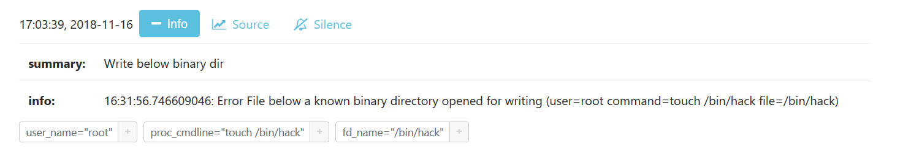

# AlertManager

- **Category**: Alerting
- **Website**: https://github.com/prometheus/alertmanager

## Table of content

- [AlertManager](#alertmanager)
  - [Table of content](#table-of-content)
  - [Configuration](#configuration)
  - [Example of config.yaml](#example-of-configyaml)
  - [Screenshots](#screenshots)

## Configuration

| Setting                                 | Env var                                 | Default value                                                        | Description                                                                                                                                                                                                                              |
| --------------------------------------- | --------------------------------------- | -------------------------------------------------------------------- | ---------------------------------------------------------------------------------------------------------------------------------------------------------------------------------------------------------------------------------------- |
| `alertmanager.hostport`                 | `ALERTMANAGER_HOSTPORT`                 |                                                                      | http://{domain or ip}:{port}, if not empty, Alertmanager output is **enabled**                                                                                                                                                           |
| `alertmanager.mutualtls`                | `ALERTMANAGER_MUTUALTLS`                | `false`                                                              | Authenticate to the output with TLS, if true, checkcert flag will be ignored (server cert will always be checked)                                                                                                                        |
| `alertmanager.checkcert`                | `ALERTMANAGER_CHECKCERT`                | `true`                                                               | check if ssl certificate of the output is valid                                                                                                                                                                                          |
| `alertmanager.endpoint`                 | `ALERTMANAGER_ENDPOINT`                 | `/api/v1/alerts`                                                     | Alertmanager endpoint for posting alerts `/api/v1/alerts` or `/api/v2/alerts`                                                                                                                                                            |
| `alertmanager.expiresafter`             | `ALERTMANAGER_EXPIRESAFTER`             | `0`                                                                  | If set to a non-zero value, alert expires after that time in seconds                                                                                                                                                                     |
| `alertmanager.extralabels`              | `ALERTMANAGER_EXTRALABELS`              |                                                                      | Comma separated list of labels composed of a ':' separated name and value that is added to the Alerts. Example: `my_annotation_1:my_value_1, my_annotation_1:my_value_2`                                                                 |
| `alertmanager.extraannotations`         | `ALERTMANAGER_EXTRAANNOTATIONS`         |                                                                      | Comma separated list of annotations composed of a ':' separated name and value that is added to the Alerts Example: `debug:value_1,critical:value2`                                                                                      |
| `alertmanager.customseveritymap`        | `ALERTMANAGER_CUSTOMSEVERITYMAP`        |                                                                      | Comma separated list of tuple composed of a ':' separated Falco priority and Alertmanager severity that is used to override the severity label associated to the priority level of falco event. Example: `debug:value_1,critical:value2` |
| `alertmanager.dropeventdefaultpriority` | `ALERTMANAGER_DROPEVENTDEFAULTPRIORITY` | `critical`                                                           | Default priority of dropped events, values are `emergency,alert,critical,error,warning,notice,informational,debug`                                                                                                                       |
| `alertmanager.dropeventthresholds`      | `ALERTMANAGER_DROPEVENTTHRESHOLDS`      | `10000:critical, 1000:critical, 100:critical, 10:warning, 1:warning` | Comma separated list of priority re-evaluation thresholds of dropped events composed of a ':' separated integer threshold and string priority. Example: `10000:critical, 100:warning, 1:informational`                                   |
| `alertmanager.minimumpriority`          | `ALERTMANAGER_MINIMUMPRIORITY`          | `""` (= `debug`)                                                     | Minimum priority of event for using this output, order is `emergency,alert,critical,error,warning,notice,informational,debug or ""`                                                                                                      |
| `alertmanager.customheaders`            | `ALERTMANAGER_CUSTOMHEADERS`            |                                                                      | Custom headers for the POST request                                                                                                                                                                                                      |

> [!NOTE]
The Env var values override the settings from yaml file.

## Example of config.yaml

```yaml
alertmanager:
  hostport: "" # http://{domain or ip}:{port}, if not empty, Alertmanager output is enabled
  # mutualtls: false # if true, checkcert flag will be ignored (server cert will always be checked)
  # checkcert: true # check if ssl certificate of the output is valid (default: true)
  # endpoint: "" # alertmanager endpoint for posting alerts: "/api/v1/alerts" or "/api/v2/alerts" (default: "/api/v1/alerts")
  # expiresafter: "" if set to a non-zero value, alert expires after that time in seconds (default: 0)
  # extralabels: "" # comma separated list of labels composed of a ':' separated name and value that is added to the Alerts. Example: my_label_1:my_value_1, my_label_1:my_value_2
  # extraannotations: "" # comma separated list of annotations composed of a ':' separated name and value that is added to the Alerts. Example: my_annotation_1:my_value_1, my_annotation_1:my_value_2
  # customseveritymap: "" # comma separated list of tuple composed of a ':' separated Falco priority and Alertmanager severity that is used to override the severity label associated to the priority level of falco event. Example: debug:value_1,critical:value2. Default mapping: emergency:critical,alert:critical,critical:critical,error:warning,warning:warning,notice:information,informational:information,debug:information. (default: "")
  # dropeventdefaultpriority: "" # default priority of dropped events, values are emergency|alert|critical|error|warning|notice|informational|debug (default: "critical")
  # dropeventthresholds: # comma separated list of priority re-evaluation thresholds of dropped events composed of a ':' separated integer threshold and string priority. Example: `10000:critical, 100:warning, 1:informational` (default: `"10000:critical, 1000:critical, 100:critical, 10:warning, 1:warning"`)
  # minimumpriority: "" # minimum priority of event for using this output, order is emergency|alert|critical|error|warning|notice|informational|debug or "" (default)
  # customHeaders: # Custom headers to add in POST, useful for Authentication
  #   key: value
```

## Screenshots

