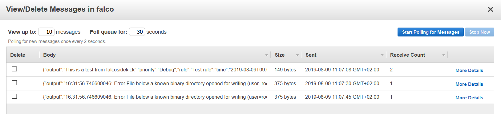

# AWS SQS

- **Category**: Message queue / Streaming
- **Website**: https://aws.amazon.com/sqs/features/

## Table of content

- [AWS SQS](#aws-sqs)
  - [Table of content](#table-of-content)
  - [Configuration](#configuration)
  - [Example of config.yaml](#example-of-configyaml)
  - [Additional info](#additional-info)
    - [SQS Sample IAM Policy](#sqs-sample-iam-policy)
  - [Screenshots](#screenshots)

## Configuration

| Setting                   | Env var                   | Default value    | Description                                                                                                                         |
| ------------------------- | ------------------------- | ---------------- | ----------------------------------------------------------------------------------------------------------------------------------- |
| `aws.accesskeyid`         | `AWS_ACCESSKEYID`         |                  | AWS access key (optional if you use EC2 Instance Profile)                                                                           |
| `aws.secretaccesskey`     | `AWS_SECRETACCESSKEY`     |                  | AWS secret access key (optional if you use EC2 Instance Profile)                                                                    |
| `aws.region`              | `AWS_REGION`              |                  | AWS region (by default, the metadata are used to get it)                                                                            |
| `aws.rolearn`             | `AWS_ROLEARN`             |                  | AWS role to assume (optional if you use EC2 Instance Profile)                                                                       |
| `aws.externalid`          | `AWS_EXTERNALID`          |                  | External id for the role to assume (optional if you use EC2 Instance Profile)                                                       |
| `aws.checkidentity`       | `AWS_CHECKIDENTITY`       | `true`           | Check the identity credentials, set to false for locale developments                                                                |
| `aws.sqs.url`             | `AWS_SQS_URL`             |                  | SQS Queue URL, if not empty, AWS SQS output is **enabled**                                                                          |
| `aws.sqs.minimumpriority` | `AWS_SQS_MINIMUMPRIORITY` | `""` (= `debug`) | Minimum priority of event for using this output, order is `emergency,alert,critical,error,warning,notice,informational,debug or ""` |

> [!NOTE]
The Env var values override the settings from yaml file.

## Example of config.yaml

```yaml
aws:
  # accesskeyid: "" # aws access key (optional if you use EC2 Instance Profile)
  # secretaccesskey: "" # aws secret access key (optional if you use EC2 Instance Profile)
  # region : "" # aws region (by default, the metadata are used to get it)
  # rolearn: "" # aws role to assume (optional if you use EC2 Instance Profile)
  # externalid: "" # external id for the role to assume (optional if you use EC2 Instance Profile)
  # checkidentity: true # check the identity credentials, set to false for locale developments (default: true)
  sqs:
    # url : "" # SQS Queue URL, if not empty, AWS SQS output is enabled
    # minimumpriority: "" # minimum priority of event for using this output, order is emergency|alert|critical|error|warning|notice|informational|debug or "" (default)
```

## Additional info

> [!NOTE]
When using this AWS output you will need to set the AWS keys or role with some permissions.

### SQS Sample IAM Policy

```json
{
  "Version": "2012-10-17",
  "Id": "sqs",
  "Statement": [
    {
      "Sid": "sendMessage",
      "Effect": "Allow",
      "Principal": "*",
      "Action": "sqs:SendMessage",
      "Resource": "arn:aws:sqs:*:111122223333:queue1"
    }
  ]
}
```

## Screenshots

