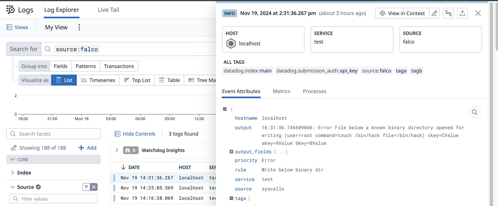

# Datadog Logs

- **Category**: Logs
- **Website**: https://www.datadoghq.com/

## Table of content

- [Datadog Logs](#datadogLogs)
  - [Table of content](#table-of-content)
  - [Configuration](#configuration)
  - [Example of config.yaml](#example-of-configyaml)
  - [Additional info](#additional-info)
  - [Screenshots](#screenshots)

## Configuration

| Setting                       | Env var                        | Default value              | Description                                                                                                                       |
|-------------------------------|--------------------------------| -------------------------- | --------------------------------------------------------------------------------------------------------------------------------- |
| `datadogLogs.apikey`          | `DATADOG_LOGS_APIKEY`          |                            | Datadog API Key, if not empty, Datadog output is **enabled**                                                                      |
| `datadogLogs.host`            | `DATADOG_LOGS_HOST`            | `https://http-intake.logs.datadoghq.com/` | Datadog host. Override if you are on the Datadog EU site                                                                          |
| `datadogLogs.minimumpriority` | `DATADOG_LOGS_MINIMUMPRIORITY` | `""` (= `debug`)           | Minimum priority of event for using this output, order is `emergency,alert,critical,error,warning,notice,informational,debug or ""` |
| `datadogLogs.service`         | `DATADOG_LOGS_SERVICE`         | `""`            | The name of the application or service generating the log events. |

> [!NOTE]
The Env var values override the settings from yaml file.

## Example of config.yaml

```yaml
datadogLogs:
  apikey: "" # Datadog API Key, if not empty, Datadog output is enabled
  # host: "" # Datadog host. Override if you are on the Datadog EU site. Defaults to american site with "https://http-intake.logs.datadoghq.com/"
  # minimumpriority: "" # minimum priority of event for using this output, order is emergency|alert|critical|error|warning|notice|informational|debug or "" (default)
  # service: "" # The name of the application or service generating the log events.
```

## Additional info

Filter the logs in the UI with `sources: falco`.

## Screenshots


