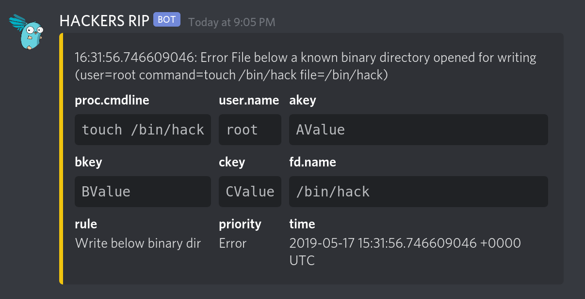

# Discord

- **Category**: Chat
- **Website**: https://www.discord.com/

## Table of content

- [Discord](#discord)
  - [Table of content](#table-of-content)
  - [Configuration](#configuration)
  - [Example of config.yaml](#example-of-configyaml)
  - [Additional info](#additional-info)
  - [Screenshots](#screenshots)

## Configuration

| Setting                   | Env var                   | Default value    | Description                                                                                                                         |
| ------------------------- | ------------------------- | ---------------- | ----------------------------------------------------------------------------------------------------------------------------------- |
| `discord.webhookurl`      | `DISCORD_WEBHOOKURL`      |                  | Discord WebhookURL (ex: https://discord.com/api/webhooks/xxxxxxxxxx...), if not empty, Discord output is **enabled**                |
| `discord.ICON`            | `DISCORD_ICON`            |                  | Discord icon (avatar)                                                                                                               |
| `discord.minimumpriority` | `DISCORD_MINIMUMPRIORITY` | `""` (= `debug`) | Minimum priority of event for using this output, order is `emergency,alert,critical,error,warning,notice,informational,debug or ""` |

> [!NOTE]
The Env var values override the settings from yaml file.

## Example of config.yaml

```yaml
discord:
  webhookurl: "" # discord WebhookURL (ex: https://discord.com/api/webhooks/xxxxxxxxxx...), if not empty, Discord output is enabled
  # icon: "" # Discord icon (avatar)
  # minimumpriority: "debug" # minimum priority of event for using this output, order is emergency|alert|critical|error|warning|notice|informational|debug or "" (default)
```

## Additional info

## Screenshots


