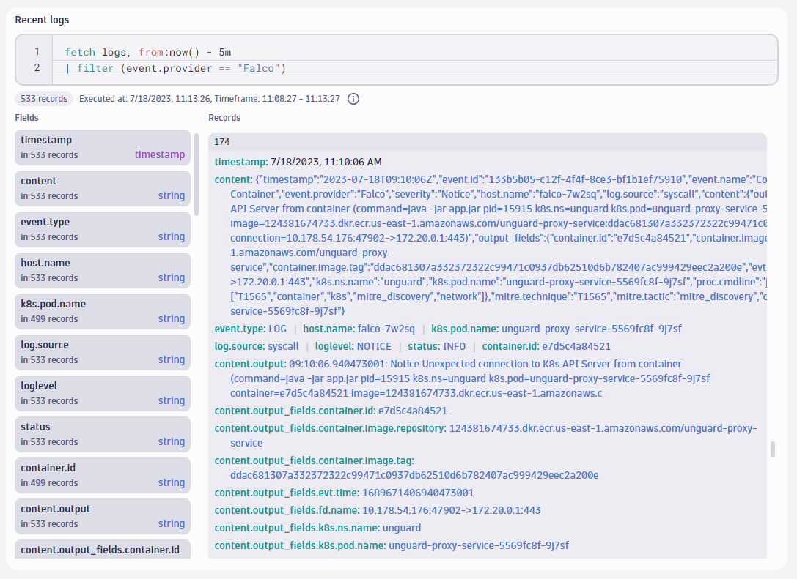

# Dynatrace

- **Category**: Metrics / Observability
- **Website**: https://www.dynatrace.com/

## Table of content

- [Dynatrace](#dynatrace)
  - [Table of content](#table-of-content)
  - [Configuration](#configuration)
  - [Example of config.yaml](#example-of-configyaml)
  - [Additional info](#additional-info)
  - [Screenshots](#screenshots)

## Configuration

| Setting | Env var | Default value | Description |
| ------- | ------- | ------------- | ----------- |
|         |         |               |             |
|         |         |               |             |
| `dynatrace.minimumpriority` | `DYNATRACE_MINIMUMPRIORITY` | `""` (= `debug`) | Minimum priority of event for using this output, order is `emergency,alert,critical,error,warning,notice,informational,debug or ""` |

> [!NOTE]
The Env var values override the settings from yaml file.

## Example of config.yaml

```yaml
dynatrace:
  apitoken: "" # Dynatrace API token with the "logs.ingest" scope, more info : https://dt-url.net/8543sda, if not empty, Dynatrace output is enabled
  apiurl: "" # Dynatrace API url, use https://ENVIRONMENTID.live.dynatrace.com/api for Dynatrace SaaS and https://YOURDOMAIN/e/ENVIRONMENTID/api for Dynatrace Managed, more info : https://dt-url.net/ej43qge
  # minimumpriority: "" # minimum priority of event for using this output, order is emergency|alert|critical|error|warning|notice|informational|debug or "" (default)
  # checkcert: true # check if ssl certificate of the output is valid (default: true)
```

## Additional info

## Screenshots

