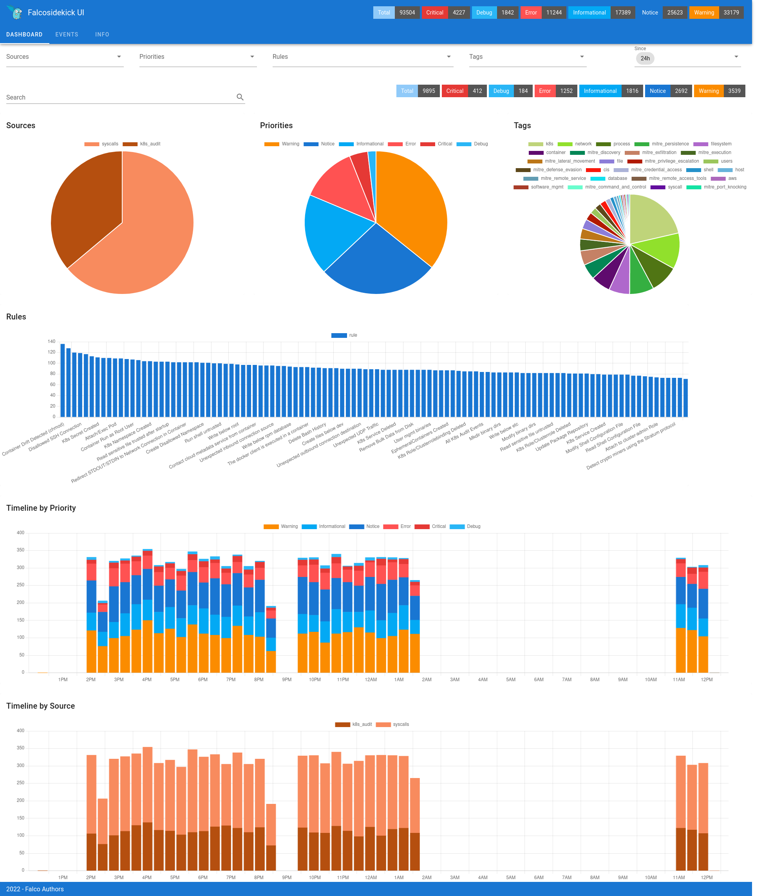
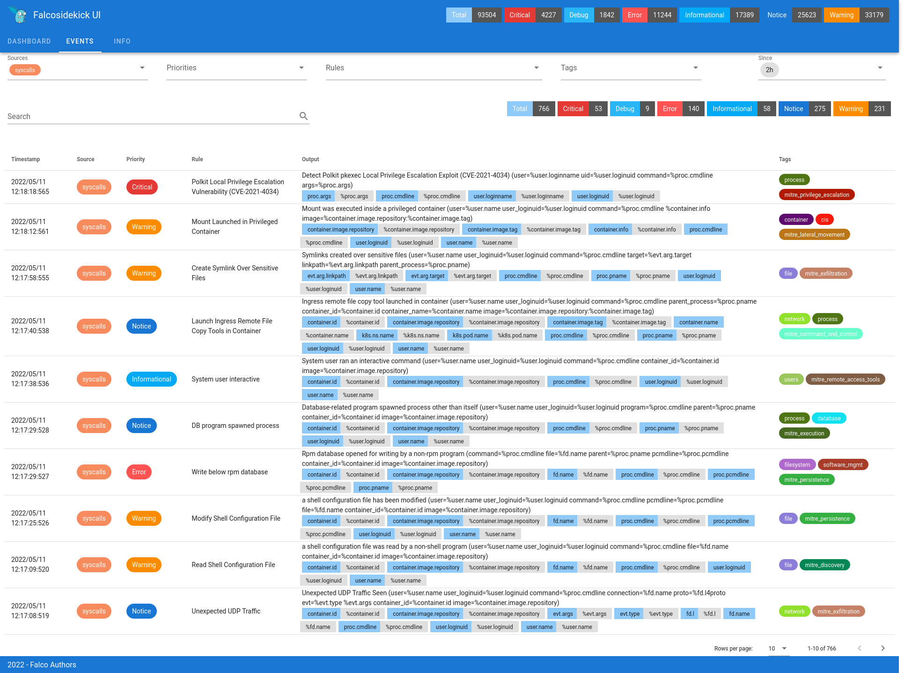

# Falcosidekick-UI

- **Category**: Metrics / Observability
- **Website**: https://github.com/falcosecurity/falcosidekick-ui

## Table of content

- [Falcosidekick-UI](#falcosidekick-ui)
  - [Table of content](#table-of-content)
  - [Configuration](#configuration)
  - [Example of config.yaml](#example-of-configyaml)
  - [Additional info](#additional-info)
  - [Screenshots](#screenshots)

## Configuration

| Setting     | Env var     | Default value | Description                                          |
| ----------- | ----------- | ------------- | ---------------------------------------------------- |
| `webui.url` | `WEBUI_URL` |               | WebUI URL, if not empty, WebUI output is **enabled** |

> [!NOTE]
The Env var values override the settings from yaml file.

## Example of config.yaml

```yaml
webui:
  url: "" # WebUI URL, if not empty, WebUI output is enabled
```

## Additional info

## Screenshots



