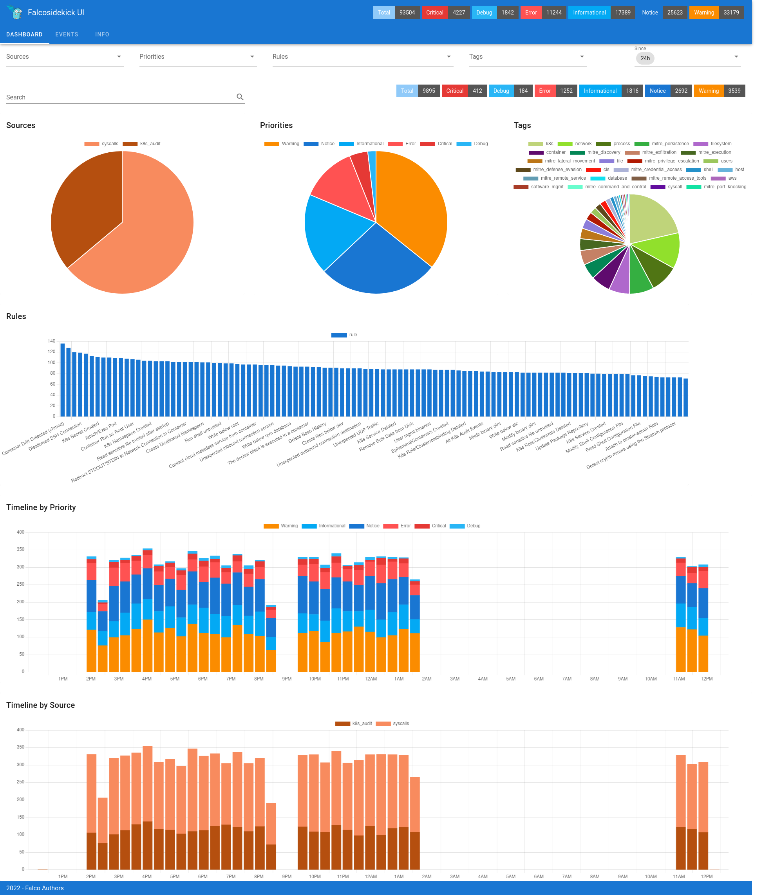
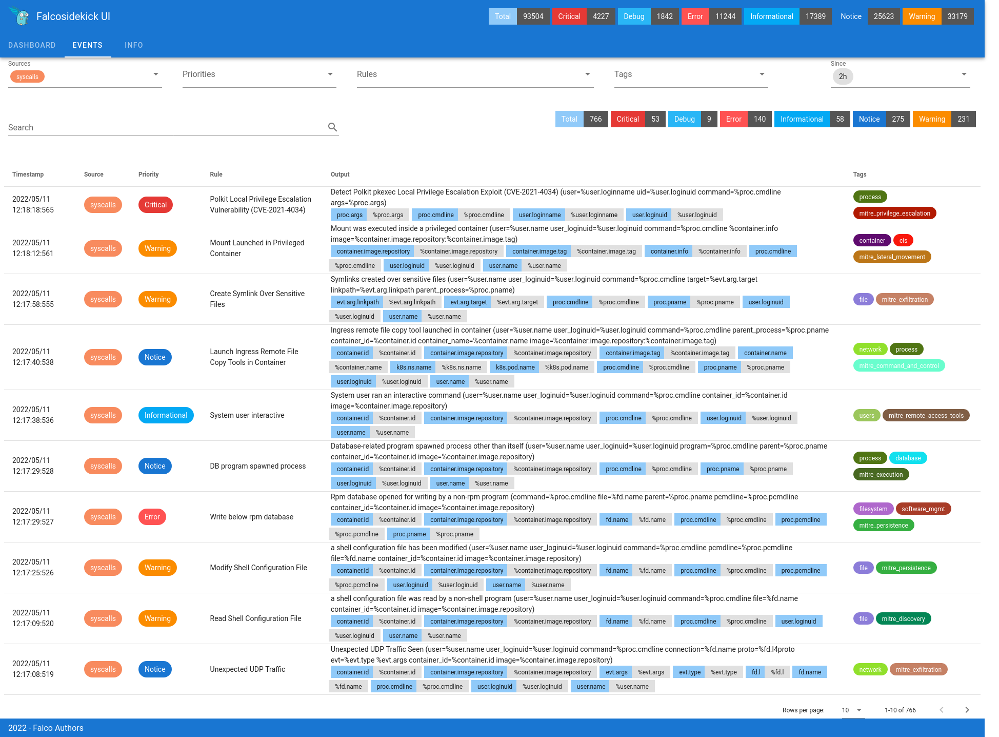

# Falcosidekick-UI

Post events to Falcosidekick WebUI with optional authentication.

- **Category**: Metrics / Observability
- **Website**: https://github.com/falcosecurity/falcosidekick-ui

## Table of content

- [Falcosidekick-UI](#falcosidekick-ui)
  - [Table of content](#table-of-content)
  - [Configuration](#configuration)
  - [Authorization](#authorization)
  - [Examples](#examples)
  - [Notes](#notes)
  - [Screenshots](#screenshots)

## Configuration

| Setting | Env var | Default | Description |
| - | - | - | - |
| `webui.url` | `WEBUI_URL` | "" | WebUI URL (e.g., `http://webui:5000`); if empty, WebUI output is disabled |
| `webui.oauth2.tokenurl` | `WEBUI_OAUTH2_TOKENURL` | "" | OAuth2 token endpoint (enables OAuth2 client credentials when set) |
| `webui.oauth2.clientid` | `WEBUI_OAUTH2_CLIENTID` | "" | OAuth2 client ID (required if `tokenurl` is set) |
| `webui.oauth2.clientsecret` | `WEBUI_OAUTH2_CLIENTSECRET` | "" | OAuth2 client secret (takes precedence over `clientsecretfile` if both are set) |
| `webui.oauth2.clientsecretfile` | `WEBUI_OAUTH2_CLIENTSECRETFILE` | "" | Path to file containing OAuth2 client secret (takes precedence over `clientsecret`; useful for Kubernetes secrets mounted as files) |
| `webui.oauth2.scopes` | `WEBUI_OAUTH2_SCOPES` | "" | OAuth2 scopes, comma or space-separated (optional; e.g., `api,read` or `api read`) |
| `webui.oauth2.audience` | `WEBUI_OAUTH2_AUDIENCE` | "" | OAuth2 audience claim (optional; sent as `audience` form parameter and optionally as `resource` per RFC 8707 if `resourceindicator=true`) |
| `webui.oauth2.resourceindicator` | `WEBUI_OAUTH2_RESOURCEINDICATOR` | `false` | Send audience as `resource` parameter (RFC 8707) in addition to `audience` |
| `webui.oauth2.cafile` | `WEBUI_OAUTH2_CAFILE` | "" | Path to PEM file with CA certificate(s) for verifying token endpoint TLS certificate (optional; appended to system roots; useful for internal CAs like step-ca) |
| `webui.tokenfile` | `WEBUI_TOKENFILE` | "" | Path to token file (enables token file mode; mutually exclusive with OAuth2 configuration); token is read from this file, cached, and re-read when file is modified (mtime polling every 30s) |
| `webui.checkcert` | `WEBUI_CHECKCERT` | `true` | Check if SSL certificate of the WebUI server is valid |
| `webui.mutualtls` | `WEBUI_MUTUALTLS` | `false` | If true, mutual TLS is enabled (server cert is always checked) |

> [!NOTE]
> The Env var values override the settings from yaml file.

## Authorization

If `webui.oauth2.tokenurl` or `webui.tokenfile` is configured, every POST request to the WebUI includes an `Authorization: Bearer <token>` header.

**Important:** The falcosidekick-ui must have ingestion authentication enabled (e.g., `FALCOSIDEKICK_UI_INGEST_AUTH=oidc`) for the token to be enforced.

### Validation

- Both OAuth2 (`tokenurl` set) and token file (`tokenfile` set) cannot be configured simultaneously; startup fails if both are set.
- If OAuth2 is enabled, `clientid` is required; startup fails otherwise.
- OAuth2 requires either `clientsecret` or `clientsecretfile` to be set; startup fails otherwise.
- OAuth2 `tokenurl` must use HTTPS unless the host is a loopback address (localhost, 127.0.0.1, [::1]); startup fails otherwise (the client secret must not travel in cleartext).
- If a token source is configured but the WebUI URL is HTTP (not HTTPS) and not a loopback address (localhost, 127.0.0.1, [::1]), a warning is logged: "bearer token sent over plaintext HTTP; use TLS or a service mesh" (the WebUI output is still enabled).

## Examples

### OAuth2 Client Credentials (Keycloak)

Configure a service account on Keycloak with an audience mapper to include the WebUI API audience in the token's `aud` claim:

```yaml
webui:
  url: "https://webui.example.com"
  oauth2:
    tokenurl: "https://keycloak.example.com/auth/realms/myrealm/protocol/openid-connect/token"
    clientid: "falcosidekick"
    clientsecret: "my-secret-key"
    scopes: "api,read"
    audience: "falcosidekick-ui"
    cafile: "/etc/ssl/certs/ca-bundle.crt"
```

Environment variables:
```bash
WEBUI_URL=https://webui.example.com
WEBUI_OAUTH2_TOKENURL=https://keycloak.example.com/auth/realms/myrealm/protocol/openid-connect/token
WEBUI_OAUTH2_CLIENTID=falcosidekick
WEBUI_OAUTH2_CLIENTSECRET=my-secret-key
WEBUI_OAUTH2_SCOPES="api,read"
WEBUI_OAUTH2_AUDIENCE=falcosidekick-ui
WEBUI_OAUTH2_CAFILE=/etc/ssl/certs/ca-bundle.crt
```

### Kubernetes Projected ServiceAccount Token

Use Kubernetes projected service account tokens (automatically rotated by kubelet) for authentication:

```yaml
webui:
  url: "https://webui.default.svc"
  tokenfile: "/var/run/secrets/tokens/falcosidekick-ui"
```

Kubernetes Deployment/Pod spec:
```yaml
apiVersion: v1
kind: Pod
spec:
  serviceAccountName: falcosidekick
  containers:
  - name: falcosidekick
    image: falcosecurity/falcosidekick:latest
    volumeMounts:
    - name: ui-token
      mountPath: /var/run/secrets/tokens
      readOnly: true
  volumes:
  - name: ui-token
    projected:
      sources:
      - serviceAccountToken:
          path: falcosidekick-ui
          audience: falcosidekick-ui
          expirationSeconds: 3600
```

Environment variable:
```bash
WEBUI_URL=https://webui.default.svc
WEBUI_TOKENFILE=/var/run/secrets/tokens/falcosidekick-ui
```

## Notes

- If neither `oauth2.tokenurl` nor `tokenfile` is configured, the WebUI output behaves exactly as before (no `Authorization` header is sent). This is fully backward compatible.
- OAuth2 tokens are cached and automatically refreshed by the `TokenSource` (with reuse semantics per `golang.org/x/oauth2`); a token is never fetched per event.
- Token file contents are cached and the file is stat-checked at most every 30 seconds for changes (mtime comparison); whitespace is trimmed before use.
- Sensitive fields (`oauth2.clientsecret`) are masked after initialization to prevent accidental leakage in logs.
- Token HTTP client uses TLS 1.2 minimum and a 10-second timeout for security and reliability.

## Screenshots



