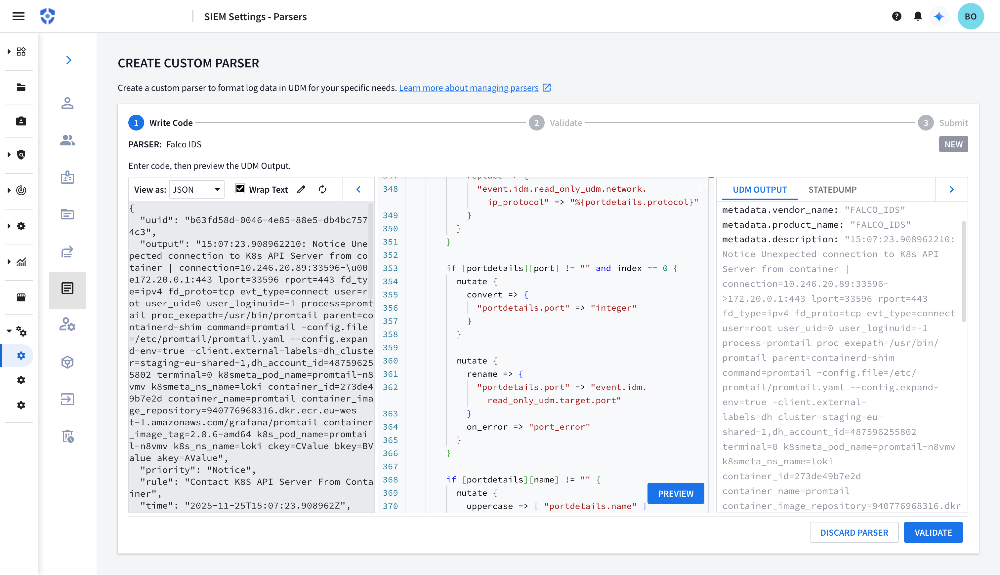

# Google SecOps (Chronicle) 

- **Category**: Security / SIEM
- **Website**: https://cloud.google.com/chronicle/docs

## Table of contents

- [Google SecOps (Chronicle)](#google-secops-chronicle)
  - [Table of contents](#table-of-contents)
  - [Configuration](#configuration)
  - [Example of config.yaml](#example-of-configyaml)
  - [Additional info](#additional-info)
  - [Screenshots](#screenshots)

## Configuration

| Setting                          | Env var                          | Default value    | Description                                                                                                                         |
| -------------------------------- | -------------------------------- | ---------------- | ----------------------------------------------------------------------------------------------------------------------------------- |
| `gcp.credentials`                | `GCP_CREDENTIALS`                |                  | The base64-encoded JSON key file for the GCP service account                                                                        |
| `gcp.chronicle.projectid`        | `GCP_CHRONICLE_PROJECTID`        |                  | The GCP Project ID containing the Chronicle instance, if not empty (with instanceid), GCP Chronicle is **enabled**                  |
| `gcp.chronicle.instanceid`       | `GCP_CHRONICLE_INSTANCEID`       |                  | The Chronicle instance ID, if not empty (with projectid), GCP Chronicle is **enabled**                                             |
| `gcp.chronicle.region`           | `GCP_CHRONICLE_REGION`           |                  | The Chronicle region (e.g., "us", "europe-west12")                                                                                   |
| `gcp.chronicle.logtype`          | `GCP_CHRONICLE_LOGTYPE`          | `"FALCO_IDS"`    | The log type identifier (default: "FALCO_IDS")                                                                               |
| `gcp.chronicle.minimumpriority`  | `GCP_CHRONICLE_MINIMUMPRIORITY`  | `""` (= `debug`) | Minimum priority of event for using this output, order is `emergency,alert,critical,error,warning,notice,informational,debug or ""` |

> [!NOTE]
> The Env var values override the settings from yaml file.

## Example of config.yaml

```yaml
gcp:
  credentials: "" # The base64-encoded JSON key file for the GCP service account
  chronicle:
    projectid: "" # The GCP Project ID containing the Chronicle instance, if not empty (with instanceid), GCP Chronicle is enabled
    instanceid: "" # The Chronicle instance ID, if not empty (with projectid), GCP Chronicle is enabled
    region: "" # The Chronicle region (e.g., "us", "europe-west1")
    logtype: "FALCO_IDS" # The log type identifier (default: "FALCO_IDS")
    # minimumpriority: "debug" # minimum priority of event for using this output, order is emergency|alert|critical|error|warning|notice|informational|debug or "" (default)
```

## Additional info

### Authentication

The Chronicle integration uses the same GCP credentials as other GCP services. You can provide credentials via:

1. **Base64-encoded JSON key file**: Set `gcp.credentials` with a base64-encoded service account JSON key
2. **Application Default Credentials (ADC)**: If credentials are not provided, the integration will attempt to use ADC (useful when running on GCP infrastructure like GCE, Cloud Run, etc.)

### Log Ingestion

Falcosidekick sends Falco events to Chronicle as JSON. There is a [Falco IDS](https://docs.cloud.google.com/chronicle/docs/ingestion/parser-list/falco-ids-changelog) built-in parser that will convert the events to UDM and can be further customized.


### Required IAM Permissions

The service account used for authentication needs the following IAM permission:

- `chronicle.logs.import` - Required to import logs into Chronicle


### Log Type Configuration

The `logtype` field determines which parser Chronicle will use to process the logs. The default value is `FALCO_IDS`. If you need to use a different log type, you must create it in your Chronicle instance first. The log type must exist in Chronicle before ingestion will succeed.

## Screenshots

