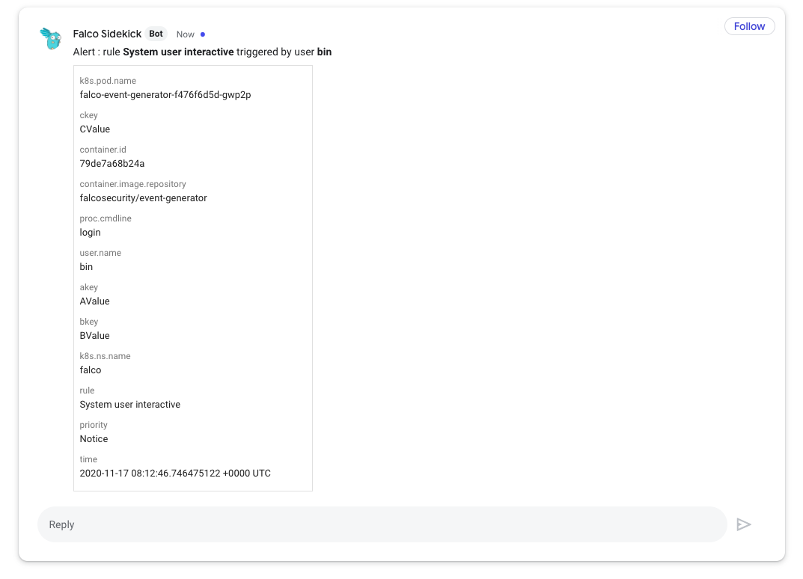
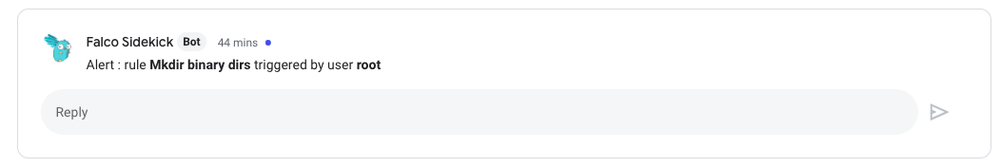

# Google Chat

- **Category**: Chat
- **Website**: https://workspace.google.com/products/chat/

## Table of content

- [Google Chat](#google-chat)
  - [Table of content](#table-of-content)
  - [Configuration](#configuration)
  - [Example of config.yaml](#example-of-configyaml)
  - [Additional info](#additional-info)
    - [Message Formatting](#message-formatting)
  - [Screenshots](#screenshots)

## Configuration

| Setting                      | Env var                      | Default value    | Description                                                                                                                                                                                                                                              |
| ---------------------------- | ---------------------------- | ---------------- | -------------------------------------------------------------------------------------------------------------------------------------------------------------------------------------------------------------------------------------------------------- |
| `googlechat.webhookurl`      | `GOOGLECHAT_WEBHOOKURL`      |                  | Google Chat WebhookURL (ex: https://chat.googleapis.com/v1/spaces/XXXXXX/YYYYYY), if not empty, Google Chat output is **enabled**                                                                                                                        |
| `googlechat.outputformat`    | `GOOGLECHAT_OUTPUTFORMAT`    | `all`            | `all`, `text`                                                                                                                                                                                                                                            |
| `googlechat.messageformat`   | `GOOGLECHAT_MESSAGEFORMAT`   |                  | A Go template to format Googlechat Text above Attachment, displayed in addition to the output from `GOOGLECHAT_OUTPUTFORMAT`, see [Message Formatting](#message-formatting) in the README for details. If empty, no Text is displayed before Attachment. |
| `googlechat.minimumpriority` | `GOOGLECHAT_MINIMUMPRIORITY` | `""` (= `debug`) | Minimum priority of event for using this output, order is `emergency,alert,critical,error,warning,notice,informational,debug or ""`                                                                                                                      |

> [!NOTE]
The Env var values override the settings from yaml file.

## Example of config.yaml

```yaml
googlechat:
  webhookurl: "" # Google Chat WebhookURL (ex: https://chat.googleapis.com/v1/spaces/XXXXXX/YYYYYY), if not empty, Google Chat output is enabled
  # outputformat: "" # all (default), text
  # messageformat: 'Alert : rule *{{ .Rule }}* triggered by user *{{ index.OutputFields "user.name" }}*' # a Go template to format Google Chat Text above Attachment, displayed in addition to the output from `GOOGLECHAT_OUTPUTFORMAT`.
  # minimumpriority: "" # minimum priority of event for using this output, order is emergency|alert|critical|error|warning|notice|informational|debug or "" (default)
```

## Additional info

### Message Formatting

The `GOOGLECHAT_MESSAGEFORMAT` environment variable and `googlechat.messageformat` YAML value accept a [Go template](https://golang.org/pkg/text/template/) which can be used to format the text of a Googlechat alert.
These templates are evaluated on the JSON data from each Falco event. The following fields are available:

| Template Syntax                              | Description                                                                                                                                                        |
| -------------------------------------------- | ------------------------------------------------------------------------------------------------------------------------------------------------------------------ |
| `{{ .Output }}`                              | A formatted string from Falco describing the event.                                                                                                                |
| `{{ .Priority }}`                            | The priority of the event, as a string.                                                                                                                            |
| `{{ .Rule }}`                                | The name of the rule that generated the event.                                                                                                                     |
| `{{ .Time }}`                                | The timestamp when the event occurred.                                                                                                                             |
| `{{ index .OutputFields \"<field name>\" }}` | A map of additional optional fields emitted depending on the event. These may not be present for every event, in which case they expand to the string `<no value>` |

Go templates also support some basic methods for text manipulation which can be used to improve the clarity of alerts - see the documentation for details.

## Screenshots

(GOOGLECHAT_OUTPUTFORMAT="**all**")



(GOOGLECHAT_OUTPUTFORMAT="**text**")

