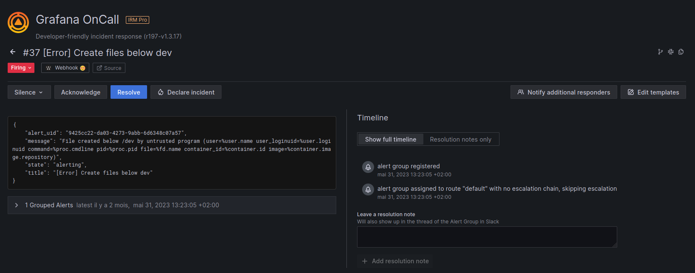

# Grafana OnCall

- **Category**: Alerting
- **Website**: https://grafana.com/products/oncall/

## Table of content

- [Grafana OnCall](#grafana-oncall)
  - [Table of content](#table-of-content)
  - [Configuration](#configuration)
  - [Example of config.yaml](#example-of-configyaml)
  - [Additional info](#additional-info)
  - [Screenshots](#screenshots)

## Configuration

| Setting                         | Env var                         | Default value    | Description                                                                                                                         |
| ------------------------------- | ------------------------------- | ---------------- | ----------------------------------------------------------------------------------------------------------------------------------- |
| `grafanaoncall.webhookurl`      | `GRAFANAONCALL_WEBHOOKURL`      |                  | If not empty, Grafana OnCall output is enabled                                                                                      |
| `grafanaoncall.customheaders`   | `GRAFANAONCALL_CUSTOMHEADERS`   |                  | Custom headers for the POST request                                                                                                 |
| `grafanaoncall.mutualtls`       | `GRAFANAONCALL_MUTUALTLS`       | `false`          | Authenticate to the output with TLS, if true, checkcert flag will be ignored (server cert will always be checked)                   |
| `grafanaoncall.checkcert`       | `GRAFANAONCALL_CHECKCERT`       | `true` | Check if ssl certificate of the output is valid                                                                                     |
| `grafanaoncall.minimumpriority` | `GRAFANAONCALL_MINIMUMPRIORITY` | `""` (= `debug`) | Minimum priority of event for using this output, order is `emergency,alert,critical,error,warning,notice,informational,debug or ""` |

> [!NOTE]
The Env var values override the settings from yaml file.

## Example of config.yaml

```yaml
grafanaoncall:
  webhookurl: "" # if not empty, Grafana OnCall output is enabled
  # customheaders: # Custom headers to add in POST, useful for Authentication
  #   key: value
  # mutualtls: false # if true, checkcert flag will be ignored (server cert will always be checked)
  # checkcert: true # check if ssl certificate of the output is valid (default: true)
  # minimumpriority: "debug" # minimum priority of event for using this output, order is emergency|alert|critical|error|warning|notice|informational|debug or "" (default)
```

## Additional info

## Screenshots


