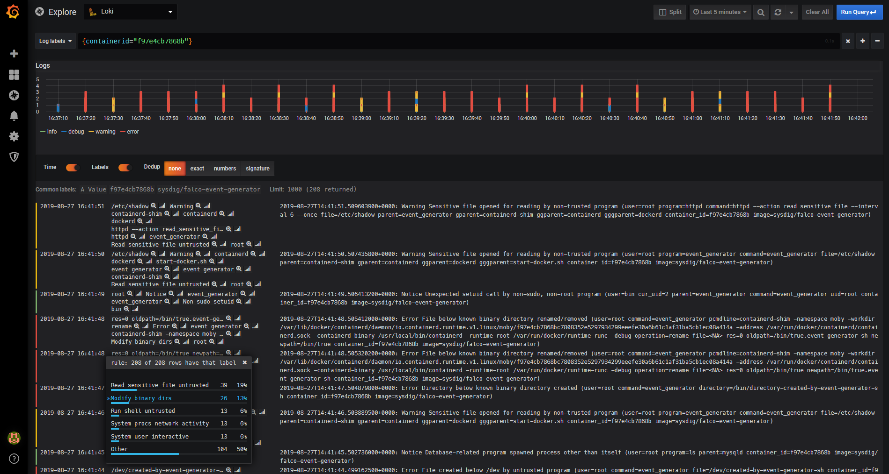

# Loki


- **Category**: Logs
- **Website**: https://grafana.com/oss/loki/

## Table of content

- [Loki](#loki)
  - [Table of content](#table-of-content)
  - [Configuration](#configuration)
  - [Example of config.yaml](#example-of-configyaml)
  - [Screenshots](#screenshots)

## Configuration

| Setting                | Env var                | Default value     | Description                                                                                                                         |
| ---------------------- | ---------------------- | ----------------- | ----------------------------------------------------------------------------------------------------------------------------------- |
| `loki.hostport`        | `LOKI_HOSTPORT`        |                   | http://{domain or ip}:{port}, if not empty, Loki output is **enabled**                                                              |
| `loki.user`            | `LOKI_USER`            |                   | User for Grafana Logs                                                                                                               |
| `loki.apikey`          | `LOKI_APIKEY`          |                   | API KEy for Grafana Logs                                                                                                            |
| `loki.tenant`          | `LOKI_TENANT`          |                   | Add the tenant header if needed                                                                                                     |
| `loki.endpoint`        | `LOKI_ENDPOINT`        | `/api/prom/push ` | The endpoint URL path, more info : https://grafana.com/docs/loki/latest/api/#post-apiprompush                                       |
| `loki.extralabels`     | `LOKI_EXTRALABELS`     |                   | comma separated list of fields to use as labels additionally to `rule`, `source`, `priority`, `tags` and `custom_fields`            |
| `loki.customheaders`   | `LOKI_CUSTOMHEADERS`   |                   | Custom headers to add in POST, useful for Authentication                                                                            |
| `loki.mutualtls`       | `LOKI_MUTUALTLS`       | `false`           | Authenticate to the output with TLS, if true, checkcert flag will be ignored (server cert will always be checked)                   |
| `loki.checkcert`       | `LOKI_CHECKCERT`       | `/api/v1/alerts`  | Check if ssl certificate of the output is valid                                                                                     | `mattermost.minimumpriority` | `MATTERMOST_MINIMUMPRIORITY` | `""` (= `debug`)                                                                                    | Minimum priority of event for using this output, order is `emergency,alert,critical,error,warning,notice,informational,debug or ""`
| `loki.minimumpriority` | `LOKI_MINIMUMPRIORITY` | `""` (= `debug`)  | Minimum priority of event for using this output, order is `emergency,alert,critical,error,warning,notice,informational,debug or ""` |


> [!NOTE]
The Env var values override the settings from yaml file.

## Example of config.yaml

```yaml
loki:
  # hostport: "" # http://{domain or ip}:{port}, if not empty, Loki output is enabled
  # user: "" # user for Grafana Logs
  # apikey: "" # API Key for Grafana Logs
  # minimumpriority: "" # minimum priority of event for using this output, order is emergency|alert|critical|error|warning|notice|informational|debug or "" (default)
  # checkcert: true # check if ssl certificate of the output is valid (default: true)
  # tenant: "" # Add the tenant header if needed. Enabled if not empty
  # endpoint: "/api/prom/push" # The endpoint URL path, default is "/api/prom/push" more info : https://grafana.com/docs/loki/latest/api/#post-apiprompush
  # extralabels: "" # comma separated list of fields to use as labels additionally to rule, source, priority, tags and custom_fields
  # customHeaders: # Custom headers to add in POST, useful for Authentication
  #   key: value
```

## Screenshots

With Grafana

