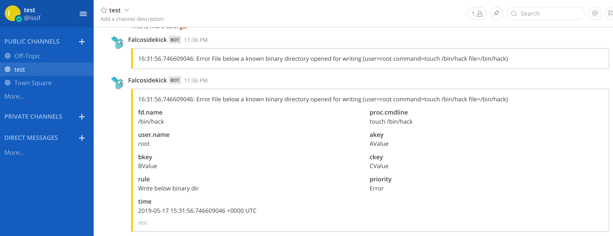

# Mattermost


- **Category**: Chat/Messaging
- **Website**: https://rocket.chat

## Table of content

- [Mattermost](#mattermost)
  - [Table of content](#table-of-content)
  - [Configuration](#configuration)
  - [Example of config.yaml](#example-of-configyaml)
  - [Additional info](#additional-info)
    - [Message Formatting](#message-formatting)
  - [Screenshots](#screenshots)

## Configuration


| Setting                      | Env var                      | Default value                                                                                       | Description                                                                                                                                                                                                                                                                    |
| ---------------------------- | ---------------------------- | --------------------------------------------------------------------------------------------------- | ------------------------------------------------------------------------------------------------------------------------------------------------------------------------------------------------------------------------------------------------------------------------------ |
| `mattermost.webhookurl`      | `MATTERMOST_WEBHOOKURL`      |                                                                                                     | Mattermost WebhookURL (ex: https://hooks.mattermost.com/services/XXXX/YYYY/ZZZZ), if not empty, Mattermost output is **enabled**                                                                                                                                               |
| `mattermost.icon`            | `MATTERMOST_ICON`            | `https://raw.githubusercontent.com/falcosecurity/falcosidekick/master/imgs/falcosidekick_color.png` | Mattermost icon (avatar)                                                                                                                                                                                                                                                       |
| `mattermost.username`        | `MATTERMOST_USERNAME`        | `Falcosidekick`                                                                                     | Mattermost username                                                                                                                                                                                                                                                            |
| `mattermost.outputformat`    | `MATTERMOST_OUTPUTFORMAT`    | `all`                                                                                               | Mattermost message format: `all`, `text`, `field`                                                                                                                                                                                                                              |
| `mattermost.messageformat`   | `MATTERMOST_MESSAGEFORMAT`   |                                                                                                     | A Go template to format Mattermost Text above Attachment, displayed in addition to the output from `MATTERMOST_OUTPUTFORMAT`, see [Message Formatting](#message-formatting) in the README for details. If empty, no Text is displayed before Attachment. |
| `mattermost.mutualtls`       | `MATTERMOST_MUTUALTLS`       | `false`                                                                                             | Authenticate to the output with TLS, if true, checkcert flag will be ignored (server cert will always be checked)                                                                                                                                                              |
| `mattermost.checkcert`       | `MATTERMOST_CHECKCERT`       | `/api/v1/alerts`                                                                                    | Check if ssl certificate of the output is valid                                                                                                                                                                                                                                | `mattermost.minimumpriority` | `MATTERMOST_MINIMUMPRIORITY` | `""` (= `debug`)                                                                                    | Minimum priority of event for using this output, order is `emergency,alert,critical,error,warning,notice,informational,debug or ""`
| `mattermost.minimumpriority` | `MATTERMOST_MINIMUMPRIORITY` | `""` (= `debug`)                                                                                    | Minimum priority of event for using this output, order is `emergency,alert,critical,error,warning,notice,informational,debug or ""`                                                                                                                                            |


> [!NOTE]
The Env var values override the settings from yaml file.

## Example of config.yaml

```yaml
mattermost:
  webhookurl: "" # Mattermost WebhookURL (ex: http://XXXX/hooks/YYYY), if not empty, Mattermost output is enabled
  # icon: "" # Mattermost icon (avatar)
  # username: "" # Mattermost username (default: Falcosidekick)
  # outputformat: "all" # all (default), text, fields
  # messageformat: "Alert : rule *{{ .Rule }}* triggered by user *{{ index .OutputFields \"user.name\" }}*" # a Go template to format Mattermost Text above Attachment, displayed in addition to the output from `MATTERMOST_OUTPUTFORMAT`. If empty, no Text is displayed before Attachment.
  # mutualtls: false # if true, checkcert flag will be ignored (server cert will always be checked)
  # checkcert: true # check if ssl certificate of the output is valid (default: true)
  minimumpriority: "" # minimum priority of event for using this output, order is emergency|alert|critical|error|warning|notice|informational|debug or "" (default)
```

## Additional info

### Message Formatting

The `MATTERMOST_MESSAGEFORMAT` environment variable and `mattermost.messageformat` YAML value accept a [Go template](https://golang.org/pkg/text/template/) which can be used to format the text of a Mattermost alert.
These templates are evaluated on the JSON data from each Falco event. The following fields are available:

| Template Syntax                              | Description                                                                                                                                                        |
| -------------------------------------------- | ------------------------------------------------------------------------------------------------------------------------------------------------------------------ |
| `{{ .Output }}`                              | A formatted string from Falco describing the event.                                                                                                                |
| `{{ .Priority }}`                            | The priority of the event, as a string.                                                                                                                            |
| `{{ .Rule }}`                                | The name of the rule that generated the event.                                                                                                                     |
| `{{ .Time }}`                                | The timestamp when the event occurred.                                                                                                                             |
| `{{ index .OutputFields \"<field name>\" }}` | A map of additional optional fields emitted depending on the event. These may not be present for every event, in which case they expand to the string `<no value>` |

Go templates also support some basic methods for text manipulation which can be used to improve the clarity of alerts - see the documentation for details.

## Screenshots

