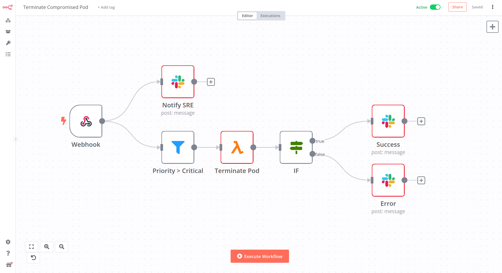

# N8N

- **Category**: Workflow
- **Website**: https://n8n.io/

## Table of content

- [N8N](#n8n)
  - [Table of content](#table-of-content)
  - [Configuration](#configuration)
  - [Example of config.yaml](#example-of-configyaml)
  - [Additional info](#additional-info)
  - [Screenshots](#screenshots)

## Configuration

| Setting               | Env var               | Default value    | Description                                                                                                                         |
| --------------------- | --------------------- | ---------------- | ----------------------------------------------------------------------------------------------------------------------------------- |
| `n8n.address`         | `N8N_ADDRESS`         |                  | N8N address, if not empty, N8N output is **enabled**                                                                                |
| `n8n.user`            | `N8N_USER`            |                  | Username to authenticate with N8N in basic auth                                                                                     |
| `n8n.password`        | `N8N_PASSWORD`        |                  | Password to authenticate with N8N in basic auth                                                                                     |
| `n8n.headerauthname`  | `N8N_HEADERAUTHNAME`  |                  | Header Auth Value to authenticate with N8N                                                                                          |
| `n8n.headerauthvalue` | `N8N_HEADERAUTHVALUE` |                  | Check if ssl certificate of the output is valid                                                                                     |
| `n8n.checkcert`       | `N8N_CHECKCERT`       | `true`           | Check if ssl certificate of the output is valid                                                                                     |
| `n8n.minimumpriority` | `N8N_MINIMUMPRIORITY` | `""` (= `debug`) | Minimum priority of event for using this output, order is `emergency,alert,critical,error,warning,notice,informational,debug or ""` |

> [!NOTE]
The Env var values override the settings from yaml file.

## Example of config.yaml

```yaml
n8n:
  address: "" # N8N address, if not empty, N8N output is enabled
  # user: "" # Username to authenticate with N8N in basic auth
  # password: "" # Password to authenticate with N8N in basic auth
  # headerauthname: "" # Header Auth Key to authenticate with N8N
  # headerauthvalue: "" # 
  # checkcert: true # check if ssl certificate of the output is valid (default: true)
  # minimumpriority: "" # minimum priority of event for using this output, order is emergency|alert|critical|error|warning|notice|informational|debug or "" (default)

```

## Additional info

## Screenshots


