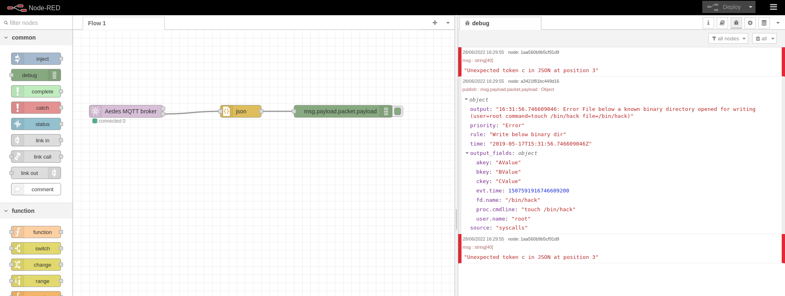

# Node-RED

- **Category**: Workflow
- **Website**: https://nodered.org/

## Table of content

- [Node-RED](#node-red)
  - [Table of content](#table-of-content)
  - [Configuration](#configuration)
  - [Example of config.yaml](#example-of-configyaml)
  - [Additional info](#additional-info)
  - [Screenshots](#screenshots)

## Configuration

| Setting                   | Env var                   | Default value    | Description                                                                                                                         |
| ------------------------- | ------------------------- | ---------------- | ----------------------------------------------------------------------------------------------------------------------------------- |
| `nodered.address`         | `NODERED_ADDRESS`         |                  | Node-RED address, if not empty, Node-RED output is **enabled**                                                                      |
| `nodered.user`            | `NODERED_USER`            |                  | User if Basic Auth is enabled for 'http in' node in Node-RED                                                                        |
| `nodered.password`        | `NODERED_PASSWORD`        |                  | Password if Basic Auth is enabled for 'http in' node in Node-RED                                                                    |
| `nodered.customheaders`   | `NODERED_CUSTOMHEADERS`   |                  | Custom headers for the POST request                                                                                                 |
| `nodered.checkcert`       | `NODERED_CHECKCERT`       | `true`           | Check if ssl certificate of the output is valid                                                                                     |
| `nodered.minimumpriority` | `NODERED_MINIMUMPRIORITY` | `""` (= `debug`) | Minimum priority of event for using this output, order is `emergency,alert,critical,error,warning,notice,informational,debug or ""` |

> [!NOTE]
The Env var values override the settings from yaml file.

## Example of config.yaml

```yaml
nodered:
  address: "" # Node-RED address, if not empty, Node-RFED output is enabled
  # user: "" # User if Basic Auth is enabled for 'http in' node in Node-RED
  # password: "" # Password if Basic Auth is enabled for 'http in' node in Node-RED
  # customHeaders: # Custom headers to add in POST, useful for Authentication
  #   key: value
  # minimumpriority: "" # minimum priority of event for using this output, order is emergency|alert|critical|error|warning|notice|informational|debug or "" (default)
  # checkcert: true # check if ssl certificate of the output is valid (default: true)
```

## Additional info

## Screenshots

