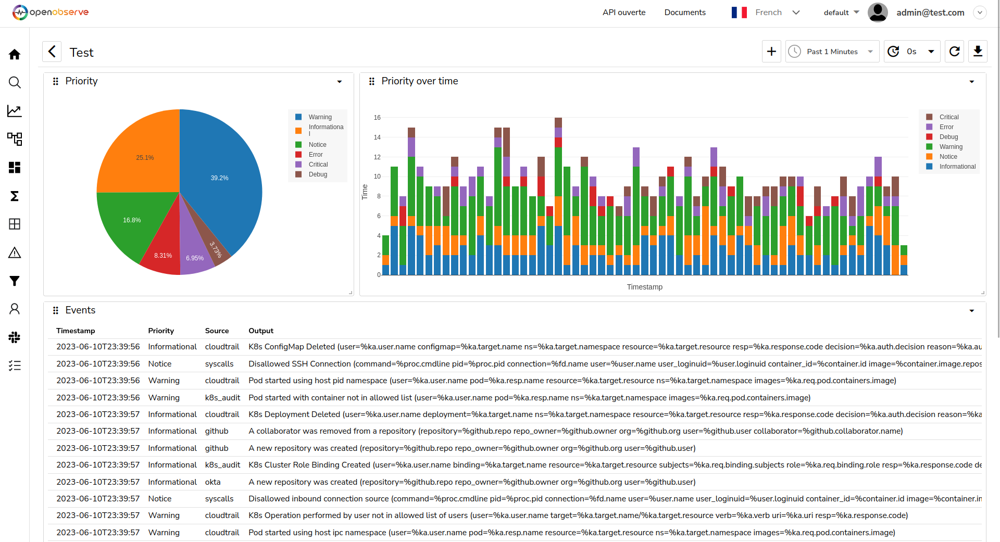

# OpenObserve

- **Category**: Logs
- **Website**: https://openobserve.ai/

## Table of content

- [OpenObserve](#openobserve)
  - [Table of content](#table-of-content)
  - [Configuration](#configuration)
  - [Example of config.yaml](#example-of-configyaml)
  - [Additional info](#additional-info)
  - [Screenshots](#screenshots)

## Configuration

| Setting                        | Env var                        | Default value    | Description                                                                                                                         |
| ------------------------------ | ------------------------------ | ---------------- | ----------------------------------------------------------------------------------------------------------------------------------- |
| `openobserve.hostport`         | `OPENOBSERVE_HOSTPORT`         |                  | http://{domain or ip}:{port}, if not empty, OpenObserve output is **enabled**                                                       |
| `openobserve.organizationname` | `OPENOBSERVE_ORGANIZATIONNAME` | `default`        | Organization name                                                                                                                   |
| `openobserve.streamname`       | `OPENOBSERVE_STREAMNAME`       | `falco`          | Stream name                                                                                                                         |
| `openobserve.username`         | `OPENOBSERVE_USERNAME`         |                  | Use this username to authenticate to OpenObserve                                                                                    |
| `openobserve.password`         | `OPENOBSERVE_PASSWORD`         |                  | Use this password to authenticate to OpenObserve                                                                                    |
| `openobserve.customheaders`    | `OPENOBSERVE_CUSTOMHEADERS`    |                  | Custom headers to add in POST, useful for Authentication                                                                            |
| `openobserve.mutualtls`        | `OPENOBSERVE_MUTUALTLS`        | `false`          | Authenticate to the output with TLS, if true, checkcert flag will be ignored (server cert will always be checked)                   |
| `openobserve.checkcert`        | `OPENOBSERVE_CHECKCERT`        | `true`           | Check if ssl certificate of the output is valid                                                                                     |
| `openobserve.minimumpriority`  | `OPENOBSERVE_MINIMUMPRIORITY`  | `""` (= `debug`) | Minimum priority of event for using this output, order is `emergency,alert,critical,error,warning,notice,informational,debug or ""` |

> [!NOTE]
The Env var values override the settings from yaml file.

## Example of config.yaml

```yaml
openobserve:
  hostport: "" # http://{domain or ip}:{port}, if not empty, OpenObserve output is enabled
  # organizationname: "default" # Organization name (default: default)
  # streamname: "falco" # Stream name (default: falco)
  # username: "a" # use this username to authenticate to OpenObserve (default: "")
  # password: "" # use this password to authenticate to OpenObserve (default: "")
  # customheaders: # Custom headers to add in POST, useful for Authentication
  #   key: value
  # mutualtls: false # if true, checkcert flag will be ignored (server cert will always be checked)
  # checkcert: true # check if ssl certificate of the output is valid (default: true)
  # minimumpriority: "" # minimum priority of event for using this output, order is emergency|alert|critical|error|warning|notice|informational|debug or "" (default)
```

## Additional info

## Screenshots

