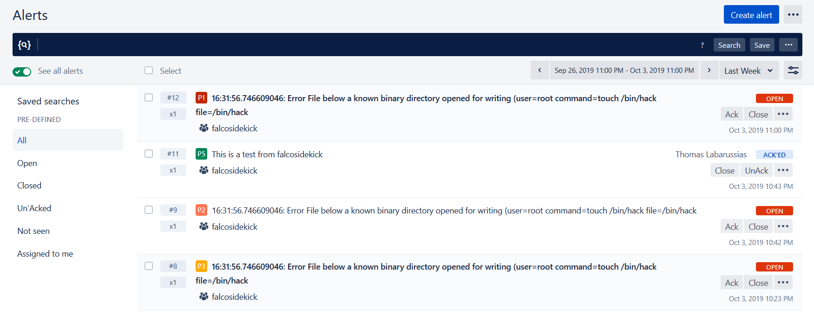

# Opsgenie

- **Category**: Alerting
- **Website**: https://www.opsgenie.com/

## Table of content

- [Opsgenie](#opsgenie)
  - [Table of content](#table-of-content)
  - [Configuration](#configuration)
  - [Example of config.yaml](#example-of-configyaml)
  - [Additional info](#additional-info)
  - [Screenshots](#screenshots)

## Configuration

| Setting                    | Env var                    | Default value    | Description                                                                                                                         |
| -------------------------- | -------------------------- | ---------------- | ----------------------------------------------------------------------------------------------------------------------------------- |
| `opsgenie.apikey`          | `OPSGENIE_APIKEY`          |                  | Opsgenie API Key, if not empty, Opsgenie output is **enabled**                                                                      |
| `opsgenie.region`          | `OPSGENIE_REGION`          | `us`             | Region of your domain (`us`, `eu`)                                                                                                  |
| `opsgenie.minimumpriority` | `OPSGENIE_MINIMUMPRIORITY` | `""` (= `debug`) | Minimum priority of event for using this output, order is `emergency,alert,critical,error,warning,notice,informational,debug or ""` |

> [!NOTE]
The Env var values override the settings from yaml file.

## Example of config.yaml

```yaml
opsgenie:
  apikey: "" # Opsgenie API Key, if not empty, Opsgenie output is enabled
  region: "eu" # Region of your domain (us|eu) (default: us)
  # minimumpriority: "" # minimum priority of event for using this output, order is emergency|alert|critical|error|warning|notice|informational|debug or "" (default)

```

## Additional info

## Screenshots


