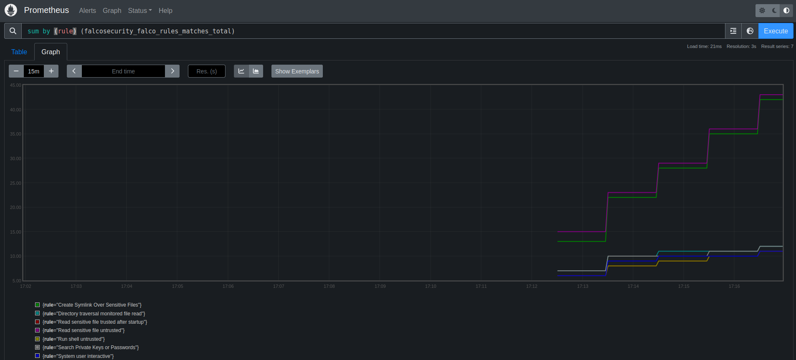

# OTEL Metrics

- **Category**: Metrics/Observability
- **Website**: <https://opentelemetry.io/docs/concepts/signals/metrics/>

## Table of content

- [OTEL Metrics](#otel-metrics)
  - [Table of content](#table-of-content)
  - [Configuration](#configuration)
  - [Example of config.yaml](#example-of-configyaml)
  - [Additional info](#additional-info)
  - [Running a whole stack with docker-compose](#running-a-whole-stack-with-docker-compose)

## Configuration

| Setting                        | Env var                        | Default value      | Description                                                                                                                                         |
|--------------------------------|--------------------------------|--------------------|-----------------------------------------------------------------------------------------------------------------------------------------------------|
| `otlp.metrics.endpoint`        | `OTLP_METRICS_ENDPOINT`        |                    | OTLP endpoint, typically in the form http{s}://{domain or ip}:4318/v1/metrics                                                                       |
| `otlp.metrics.protocol`        | `OTLP_METRICS_PROTOCOL`        | `grpc`             | OTLP transport protocol to be used for metrics data; it can be `"grpc"` or `"http/protobuf"`                                                        |
| `otlp.metrics.timeout`         | `OTLP_METRICS_TIMEOUT`         | `10000` (from SDK) | OTLP timeout for outgoing metrics in milliseconds                                                                                                   |
| `otlp.metrics.headers`         | `OTLP_METRICS_HEADERS`         | `""`               | List of headers to apply to all outgoing metrics in the form of `some-key=some-value,other-key=other-value`                                         |
| `otlp.metrics.extraenvvars`    | `OTLP_METRICS_EXTRAENVVARS`    | `""`               | Extra env vars (override the other settings)                                                                                                        |
| `otlp.metrics.minimumpriority` | `OTLP_METRICS_MINIMUMPRIORITY` | `""` (=`debug`)    | Minimum priority of event for using this output, order is `emergency,alert,critical,error,warning,notice,informational,debug or ""`                 |
| `otlp.metrics.checkcert`       | `OTLP_METRICS_CHECKCERT`       | `true`             | Set to false if you want to skip TLS certificate validation (only with https)                                                                       |
| `otlp.metrics.extraattributes` | `OTLP_METRICS_EXTRAATTRIBUTES` | `""`               | Comma-separated list of fields to use as labels additionally to source, priority, rule, hostname, tags, k8s_ns_name, k8s_pod_name and custom_fields |

> [!NOTE]
For the extra Env Vars values see [standard `OTEL_*` environment variables](https://opentelemetry.io/docs/specs/otel/configuration/sdk-environment-variables/):

## Example of config.yaml

```yaml
otlp:
  metrics:
  # endpoint: "" # OTLP endpoint, typically in the form http{s}://{domain or ip}:4318/v1/metrics
  # protocol: "" # OTLP transport protocol to be used for metrics data; it can be "grpc" or "http/protobuf" (default: "grpc")
  # timeout: "" # OTLP timeout for outgoing metrics in milliseconds (default: "" which uses SDK default: 10000)
  # headers: "" # List of headers to apply to all outgoing metrics in the form of "some-key=some-value,other-key=other-value" (default: "")
  # extraenvvars: # Extra env vars (override the other settings) (default: "")
  # OTEL_EXPORTER_OTLP_METRICS_TIMEOUT: 10000
  # OTEL_EXPORTER_OTLP_TIMEOUT: 10000
  # minimumpriority: "" # Minimum priority of event for using this output, order is emergency|alert|critical|error|warning|notice|informational|debug or "" (default: "")
  # checkcert: true # Set to false if you want to skip TLS certificate validation (only with https) (default: true)
  # extraattributes: "" # Comma-separated list of fields to use as labels additionally to source, priority, rule, hostname, tags, k8s_ns_name, k8s_pod_name and custom_fields
```

## Additional info

> [!NOTE]
This output is used to collect metrics about Falco events and Falcosidekick inputs and outputs in OTLP metrics format.

## Running a whole stack with docker-compose

Below `docker-compose` file runs a stack of:

- `falco`
- `falcosidekick`
- `prometheus` as metrics backend
- OTEL collector to collect OTEL metrics from `falcosidekick` and let prometheus scrape them
- `events-generator` to generate arbitrary Falco events

### Requirements

A local Linux kernel capable of running `falco`--modern-bpf`, see <https://falco.org/blog/falco-modern-bpf/>.

### Configuration files

You need to create these files:

- `./docker-compose.yaml`: minimal docker-compose configuration

```yaml
---
services:
  falco:
    image: falcosecurity/falco:0.39.0
    privileged: true
    volumes:
      - /var/run/docker.sock:/host/var/run/docker.sock
      - /dev:/host/dev
      - /proc:/host/proc:ro
      - /boot:/host/boot:ro
      - /lib/modules:/host/lib/modules:ro
      - /usr:/host/usr:ro
      - /etc/falco:/host/etc:ro
    command: [
      "/usr/bin/falco" ,
      "-o", "json_output=true",
      "-o", "http_output.enabled=true",
      "-o", "http_output.url=http://sidekick:2801", # Set the HTTP output url to Falco sidekick endpoint
      "-o", "http_output.insecure=true"
    ]

  sidekick:
    image: falcosidekick:latest
    ports:
      - "2801:2801" # Expose default port towards Falco instance
    environment:
      - OTLP_METRICS_ENDPOINT=http://otel-collector:4317
      - OTLP_METRICS_CHECKCERT=false

  otel-collector:
    image: otel/opentelemetry-collector-contrib
    volumes:
      - ./config.yaml:/etc/otelcol-contrib/config.yaml
    ports:
      - "4317:4317" # Expose OTLP gRPC port

  prometheus:
    image: prom/prometheus:latest
    volumes:
      - ./prometheus.yml:/etc/prometheus/prometheus.yml
    ports:
      - "9090:9090" # Expose port to access Prometheus expression browser

  event-generator:
    image: falcosecurity/event-generator
    command: run
    restart: always
  trigger:
    image: alpine
    command: [ # Alternate reads to /etc/shadow with creations of symlinks from it
      "sh",
      "-c",
      "while true; do cat /etc/shadow > /dev/null; sleep 5; ln -s /etc/shadow shadow; rm shadow; sleep 5; done"
    ]
```

> `./docker-compose.yaml` mentions the `falcosidekick:latest` docker image, that must be locally available before
> bringing up the stack. You can build it from source by cloning the repository and issuing the building commands:
> ```shell
> git clone https://github.com/falcosecurity/falcosidekick.git
> cd falcosidekick
> go build . && docker build . -t falcosidekick:latest
> ```

- `./config.yaml`: minimal OTEL collector configuration

```yaml
---
receivers:
  otlp:
    protocols:
      grpc:
        endpoint: "0.0.0.0:4317"

exporters:
  prometheus:
    endpoint: "0.0.0.0:9090"

service:
  pipelines:
    metrics:
      receivers: [otlp]
      processors: []
      exporters: [prometheus]
```

- `./prometheus.yml`: minimal prometheus configuration

```yaml
global:
  scrape_interval: 5s

scrape_configs:
  - job_name: 'otel-collector'
    static_configs:
      - targets: ['otel-collector:9090']
```

### Run it

To bring up the stack, and see the results on prometheus expression browser:

1. Bring up the stack

  ```shell
  docker compose up
  ```

2. Navigate to <http://localhost:9090/graph> to start browsing the local prometheus expression browser

3. Navigate to the `Graph` tab and adjust the time interval to be comparable to the stack uptime (e.g.: 15 minutes)

5. To get information regarding the `falcosecurity_falco_rules_matches_total` metric, you can enter a simple query like
`falcosecurity_falco_rules_matches_total` or `sum by (rule) (falcosecurity_falco_rules_matches_total)` and press
`Execute`

6. Explore the obtained results
   

1. Bring down the stack

  ```shell
  docker compose down
  ```
