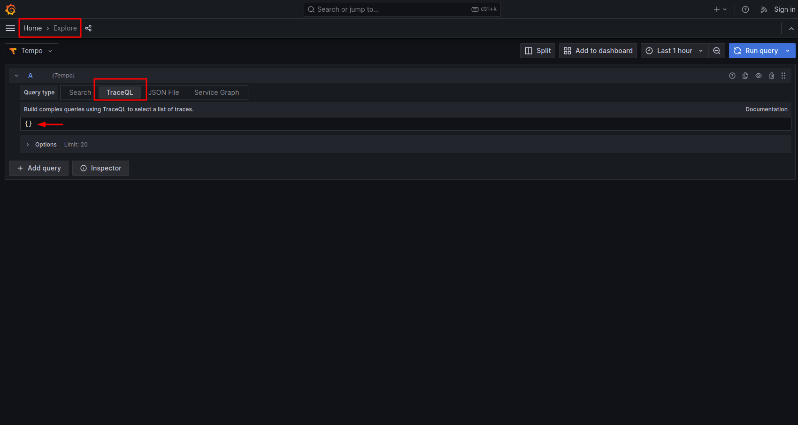
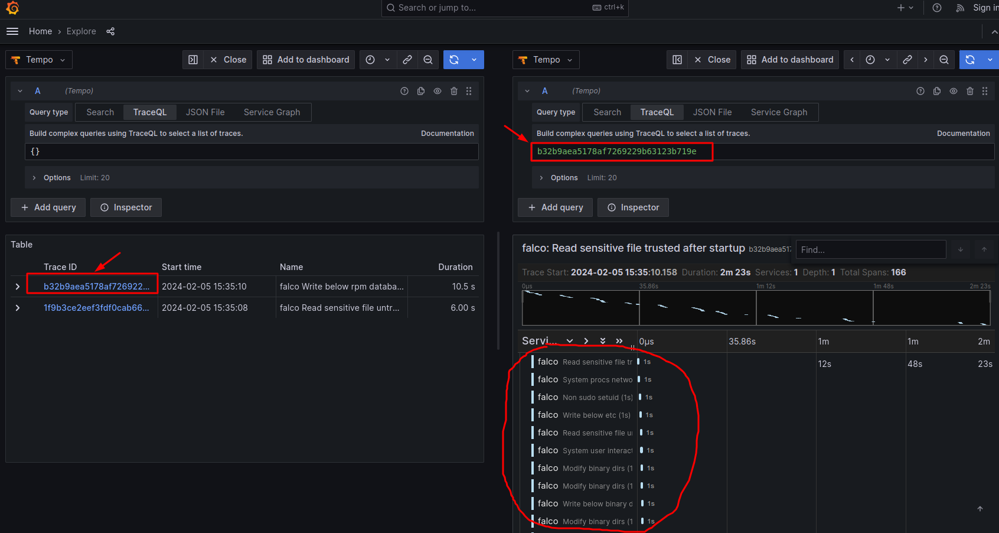

# OTEL Traces

- **Category**: Traces
- **Website**: <https://opentelemetry.io/docs/concepts/signals/traces/>

## Table of content

- [OTEL Traces](#otel-traces)
  - [Table of content](#table-of-content)
  - [Configuration](#configuration)
  - [Example of config.yaml](#example-of-configyaml)
  - [Additional info](#additional-info)
  - [Running a whole stack with docker-compose](#running-a-whole-stack-with-docker-compose)

## Configuration

|            Setting            |            Env var            |   Default value    |                                                             Description                                                             |
| ----------------------------- | ----------------------------- | ------------------ | ----------------------------------------------------------------------------------------------------------------------------------- |
| `otlp.traces.endpoint`        | `OTLP_TRACES_ENDPOINT`        |                    | OTLP endpoint in the form of http://{domain or ip}:4318/v1/traces                                                                   |
| `otlp.traces.protocol`        | `OTLP_TRACES_PROTOCOL`        | `http` (from SDK)  | OTLP Protocol                                                                                                                       |
| `otlp.traces.timeout`         | `OTLP_TRACES_TIMEOUT`         | `10000` (from SDK) | Timeout value in milliseconds                                                                                                       |
| `otlp.traces.headers`         | `OTLP_TRACES_HEADERS`         |                    | List of headers to apply to all outgoing traces in the form of "some-key=some-value,other-key=other-value"                          |
| `otlp.traces.synced`          | `OTLP_TRACES_SYNCED`          | `false`            | Set to `true` if you want traces to be sent synchronously                                                                           |
| `otlp.traces.minimumpriority` | `OTLP_TRACES_MINIMUMPRIORITY` | `""` (=`debug`)    | minimum priority of event for using this output, order is `emergency,alert,critical,error,warning,notice,informational,debug or ""` |
| `otlp.traces.checkcert`       | `OTLP_TRACES_CHECKCERT`       | `false`            | Set if you want to skip TLS certificate validation                                                                                  |
| `otlp.traces.duration`        | `OTLP_TRACES_DURATION`        | `1000`             | Artificial span duration in milliseconds (as Falco doesn't provide an ending timestamp)                                             |
| `otlp.traces.extraenvvars`    | `OTLP_TRACES_EXTRAENVVARS`    |                    | Extra env vars (override the other settings)                                                                                        |

> [!NOTE]
For the extra Env Vars values see [standard `OTEL_*` environment variables](https://opentelemetry.io/docs/specs/otel/configuration/sdk-environment-variables/):

## Example of config.yaml

```yaml
otlp:
  traces:
    # endpoint: "" # OTLP endpoint in the form of http://{domain or ip}:4318/v1/traces
    # protocol: "" # OTLP protocol http/json, http/protobuf, grpc (default: "" which uses SDK default: http/json)
    # timeout: "" # OTLP timeout: timeout value in milliseconds (default: "" which uses SDK default: 10000)
    # headers: "" # OTLP headers: list of headers to apply to all outgoing traces in the form of "some-key=some-value,other-key=other-value" (default: "")
    # synced: false # Set to true if you want traces to be sent synchronously (default: false)
    # duration: 1000 # Artificial span duration in milliseconds (default: 1000)
    # extraenvvars: # Extra env vars (override the other settings)
      # OTEL_EXPORTER_OTLP_TRACES_TIMEOUT: 10000
      # OTEL_EXPORTER_OTLP_TIMEOUT: 10000
    # minimumpriority: "" # minimum priority of event for using this output, order is emergency|alert|critical|error|warning|notice|informational|debug or "" (default)
    # checkcert: true # Set if you want to skip TLS certificate validation (default: true)
```

## Additional info

> [!NOTE]
The OTLP Traces are only available for the source: `syscalls`.

## Running a whole stack with docker-compose

Below `docker-compose` file runs a stack of:

- `falco`
- `falcosidekick`
- `events-generator` to generate arbitrary falco events
- [Tempo](https://grafana.com/oss/tempo/) as OTLP traces backend
- [Grafana](https://grafana.com/oss/grafana/) for visualization

### Requirements

A local Linux kernel capable of running `falco`--modern-bpf`, see
<https://falco.org/blog/falco-modern-bpf/>.

### Configuration files

You need to create these files:

- `./docker-compose.yaml`: minimal docker-compose configuration

```yaml
---
version: "3.9"
services:
  falco:
    image: falcosecurity/falco-no-driver:latest
    privileged: true
    command: "falco --modern-bpf -r /etc/falco/rules"
    volumes:
      - /var/run/docker.sock:/host/var/run/docker.sock
      - /dev:/host/dev
      - /proc:/host/proc:ro
      - /boot:/host/boot:ro
      - /lib/modules:/host/lib/modules:ro
      - ./etc/falco:/etc/falco:ro

  falcosidekick:
    # Build from locally cloned repository
    build: ../../../
    volumes:
      - ./etc/falco:/etc/falco:ro
    command: -c /etc/falco/falcosidekick.yaml
    ports:
      - 2801:2801
    environment:
      - OTLP_TRACES_ENDPOINT=http://traces-backend:4318/v1/traces
      - OTLP_HEADERS=X-Scope-OrgID=1
      - OTLP_TRACES_SYNCED=true
  traces-backend:
    image: grafana/tempo:latest
    ports:
      - 4317
      - 4318
      - 3200
    volumes:
      - ./etc/tempo:/etc/tempo:ro
    command: "-config.file /etc/tempo/config.yaml"
    restart: always

  grafana:
    image: grafana/grafana:10.0.3
    volumes:
      - ./etc/grafana/provisioning:/etc/grafana/provisioning:ro
    environment:
      - GF_AUTH_ANONYMOUS_ENABLED=true
      - GF_AUTH_ANONYMOUS_ORG_ROLE=Admin
      - GF_AUTH_DISABLE_LOGIN_FORM=true
      - GF_FEATURE_TOGGLES_ENABLE=traceqlEditor
    ports:
      - "3000:3000"
  event-generator:
    image: falcosecurity/event-generator
    command: run
    restart: always
  trigger:
    image: alpine
    command: ["sh", "-c", "while true; do cat /etc/shadow > /dev/null; sleep 5; done"]
```

- `./etc/falco/falco.yaml`: minimal falco configuration

```yaml
---
debug: true
outputs:
  rate: 1
  max_burst: 1000
json_output: true
http_output:
  enabled: true
  url: http://falcosidekick:2801
  #url: http://172.17.0.1:2801
  user_agent: "falcosecurity/falco"
  # Tell Falco to not verify the remote server.
  insecure: true

plugins:
  - name: json
    library_path: libjson.so

stdout_output:
  enabled: true
log_stderr: true

syscall_buf_size_preset: 4
```

- `./etc/falco/rules/` folder: from upstream
  <https://github.com/falcosecurity/rules.git>

```shell
mkdir -p ./etc/falco/upstream-rules
git clone --depth 1 https://github.com/falcosecurity/rules/ ./etc/falco/upstream-rules
ln -s upstream-rules/rules ./etc/falco/rules
```

- `./etc/grafana/provisioning/datasources/datasources.yaml`: provisioning Tempo
  backend as Grafana datasource

```yaml
apiVersion: 1

datasources:
- name: Tempo
  type: tempo
  access: proxy
  orgId: 1
  url: http://traces-backend:3200
  basicAuth: false
  isDefault: true
  version: 1
  editable: false
  apiVersion: 1
  uid: tempo
  jsonData:
    httpMethod: GET
    serviceMap:
      datasourceUid: prometheus
```

- `./etc/tempo/config.yaml`: minimal tempo configuration

```yaml
---
server:
  http_listen_port: 3200

distributor:
  receivers:
    otlp:
      protocols:
        http:
        grpc:
  log_received_spans:
    enabled: true

storage:
  trace:
    backend: local
    local:
      path: /tmp/tempo/blocks
```

### Run it

To bring up the stack, and peek at how Grafana shows it:

1. Bring up the stack

  ```shell
  docker-compose up
  ```

1. Navigate to <http://localhost:3000/> to start browsing the local Grafana UI

1. Navigate to [/explore](http://localhost:3000/explore/), choose `Tempo` datasource, and query `{}`, or just click [here](http://localhost:3000/explore?orgId=1&left=%7B%22datasource%22:%22tempo%22,%22queries%22:%5B%7B%22refId%22:%22A%22,%22datasource%22:%7B%22type%22:%22tempo%22,%22uid%22:%22tempo%22%7D,%22queryType%22:%22traceql%22,%22limit%22:20,%22query%22:%22%7B%7D%22%7D%5D) for such already crafted query.
   

1. Click on any of the shown traces on the left panel, you should see something
   similar to the below attached screenshot.
   

1. Bring down the stack

  ```shell
  docker-compose down
  ```
