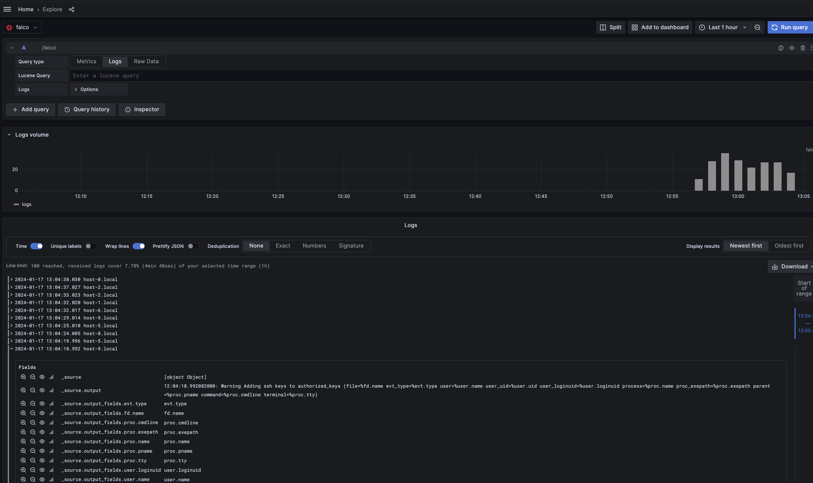

# Quickwit

- **Category**: Logs
- **Website**: https://quickwit.io/

## Table of content

- [Quickwit](#quickwit)
  - [Table of content](#table-of-content)
  - [Configuration](#configuration)
  - [Example of config.yaml](#example-of-configyaml)
  - [Screenshots](#screenshots)

## Configuration

| Setting                         | Env var                         | Default value    | Description                                                                                                                            |
| ------------------------------- | ------------------------------- | ---------------- | -------------------------------------------------------------------------------------------------------------------------------------- |
| `quickwit.hosport`              | `QUICKWIT_HOSTPORT`             |                  | http://{domain or ip}:{port}, if not empty, Quickwit output is **enabled**                                                             |
| `quickwit.apiendpoint`          | `QUICKWIT_APIENDPOINT`          | `api/v1`        | API endpoint (containing the API version, overideable in case of quickwit behind a reverse proxy with URL rewriting)                   |
| `quickwit.index`                | `QUICKWIT_INDEX`                | `falco`          | Index                                                                                                                                  |
| `quickwit.version`              | `QUICKWIT_VERSION`              | `0.7`            | Version of quickwit                                                                                                                    |
| `quickwit.autocreateindex`      | `QUICKWIT_AUTOCREATEINDEX`      | `false`          | Autocreate a `falco` index mapping if it doesn't exists                                                                                |
| `quickwit.customheaders`        | `QUICKWIT_CUSTOMHEADERS`        |                  | Custom headers to add in POST, useful for Authentication                                                                               |
| `quickwit.mutualtls`            | `QUICKWIT_MUTUALTLS`            | `false`          | Authenticate to the output with TLS, if true, checkcert flag will be ignored (server cert will always be checked)                      |
| `quickwit.checkcert`            | `QUICKWIT_CHECKCERT`            | `true`           | Check if ssl certificate of the output is valid                                                                                        |
| `quickwit.minimumpriority`      | `QUICKWIT_MINIMUMPRIORITY`      | `""` (= `debug`) | Minimum priority of event for using this output, order is `emergency,alert,critical,error,warning,notice,informational,debug or ""` |

> [!NOTE]
The Env var values override the settings from yaml file.

## Example of config.yaml

```yaml
quickwit:
  # hostport: ""
  # apiendpoint: "/api/v1"
  # index: "falco"
  # version: "0.7"
  # autocreateindex: false
  # customHeaders:
  #   key: value
  # mutualtls: false
  # checkcert: true
  # minimumpriority: ""
```

## Screenshots

With Grafana:

