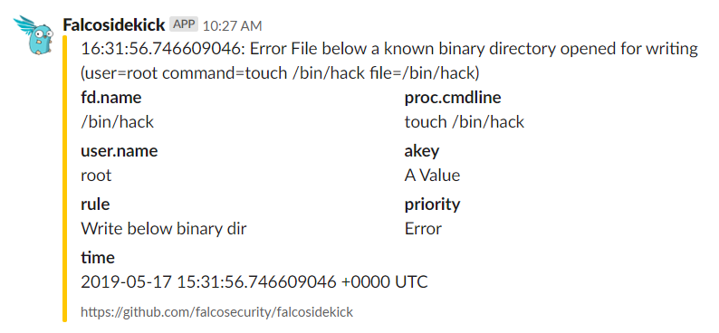
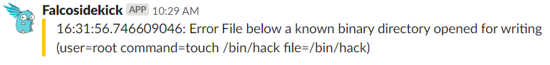
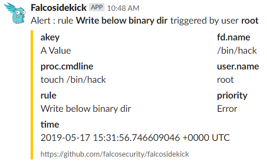

# Slack


- **Category**: Chat/Messaging
- **Website**: https://slack.com

## Table of content

- [Slack](#slack)
  - [Table of content](#table-of-content)
  - [Configuration](#configuration)
  - [Example of config.yaml](#example-of-configyaml)
  - [Additional info](#additional-info)
    - [Message Formatting](#message-formatting)
  - [Screenshots](#screenshots)

## Configuration


| Setting                 | Env var                 | Default value                                                                                       | Description                                                                                                                                                                                                                                                |
| ----------------------- | ----------------------- | --------------------------------------------------------------------------------------------------- | ---------------------------------------------------------------------------------------------------------------------------------------------------------------------------------------------------------------------------------------------------------- |
| `slack.webhookurl`      | `SLACK_WEBHOOKURL`      |                                                                                                     | Slack WebhookURL (ex: https://hooks.slack.com/services/XXXX/YYYY/ZZZZ), if not empty, Slack output is **enabled**                                                                                                                                          |
| `slack.channel`         | `SLACK_CHANNEL`         |                                                                                                     | Override the Slack channel                                                                                                                                                                                                                                 |
| `slack.footer`          | `SLACK_FOOTER`          | `https://github.com/falcosecurity/falcosidekick`                                                    | Slack footer                                                                                                                                                                                                                                               |
| `slack.icon`            | `SLACK_ICON`            | `https://raw.githubusercontent.com/falcosecurity/falcosidekick/master/imgs/falcosidekick_color.png` | Slack icon (avatar)                                                                                                                                                                                                                                        |
| `slack.username`        | `SLACK_USERNAME`        | `Falcosidekick`                                                                                     | Slack username                                                                                                                                                                                                                                             |
| `slack.outputformat`    | `SLACK_OUTPUTFORMAT`    | `all`                                                                                               | Slack message format: `all`, `text`, `field`                                                                                                                                                                                                               |
| `slack.messageformat`   | `SLACK_MESSAGEFORMAT`   |                                                                                                     | A Go template to format Slack Text above Attachment, displayed in addition to the output from `SLACK_OUTPUTFORMAT`, see [Message Formatting](#message-formatting) in the README for details. If empty, no Text is displayed before Attachment. |
| `slack.minimumpriority` | `SLACK_MINIMUMPRIORITY` | `""` (= `debug`)                                                                                    | Minimum priority of event for using this output, order is `emergency,alert,critical,error,warning,notice,informational,debug or ""`                                                                                                                        |

> [!NOTE]
The Env var values override the settings from yaml file.

## Example of config.yaml

```yaml
slack:
  webhookurl: "" # Slack WebhookURL (ex: https://hooks.slack.com/services/XXXX/YYYY/ZZZZ), if not empty, Slack output is enabled
  # channel: "" # Override the Slack channel
  # footer: "" # Slack footer (default: https://github.com/falcosecurity/falcosidekick)
  # icon: "" # Slack icon (avatar)
  # username: "" # Slack username (default: Falcosidekick)
  # outputformat: "all" # all (default), text, fields
  # minimumpriority: "" # minimum priority of event for using this output, order is emergency|alert|critical|error|warning|notice|informational|debug or "" (default)
  # messageformat: 'Alert : rule *{{ .Rule }}* triggered by user *{{ index .OutputFields "user.name" }}*' # a Go template to format Slack Text above Attachment, displayed in addition to the output from `SLACK_OUTPUTFORMAT`. If empty, no Text is displayed before Attachment.
```

## Additional info

### Message Formatting

The `SLACK_MESSAGEFORMAT` environment variable and `slack.messageformat` YAML value accept a [Go template](https://golang.org/pkg/text/template/) which can be used to format the text of a Slack alert.
These templates are evaluated on the JSON data from each Falco event. The following fields are available:

| Template Syntax                              | Description                                                                                                                                                        |
| -------------------------------------------- | ------------------------------------------------------------------------------------------------------------------------------------------------------------------ |
| `{{ .Output }}`                              | A formatted string from Falco describing the event.                                                                                                                |
| `{{ .Priority }}`                            | The priority of the event, as a string.                                                                                                                            |
| `{{ .Rule }}`                                | The name of the rule that generated the event.                                                                                                                     |
| `{{ .Time }}`                                | The timestamp when the event occurred.                                                                                                                             |
| `{{ index .OutputFields \"<field name>\" }}` | A map of additional optional fields emitted depending on the event. These may not be present for every event, in which case they expand to the string `<no value>` |

Go templates also support some basic methods for text manipulation which can be used to improve the clarity of alerts - see the documentation for details.

## Screenshots

(SLACK_OUTPUTFORMAT="**all**")



(SLACK_OUTPUTFORMAT="**text**")



(SLACK_OUTPUTFORMAT="**fields**" and SLACK_MESSAGEFORMAT="**Alert: rule \*{{ .Rule }}\* triggered by user \*{{ index .OutputFields \"user.name\" }}\***")


