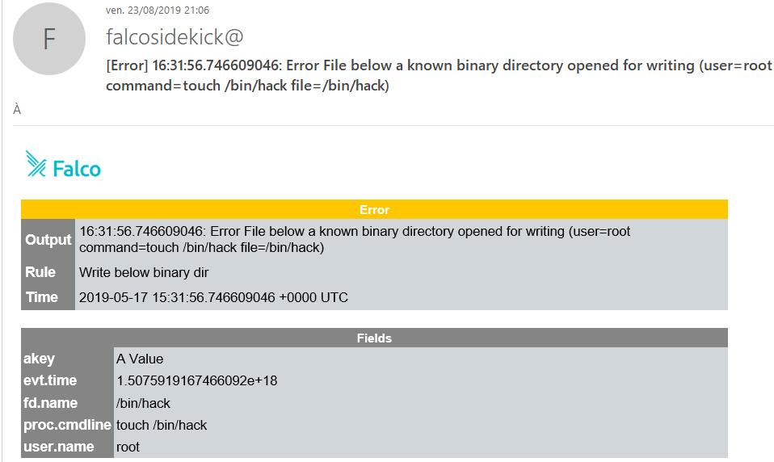
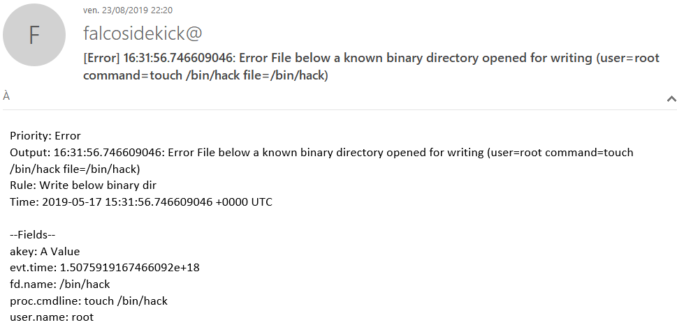

# SMTP


- **Category**: Email
- **Website**: https://en.wikipedia.org/wiki/Simple_Mail_Transfer_Protocol

## Table of content

- [SMTP](#smtp)
  - [Table of content](#table-of-content)
  - [Configuration](#configuration)
  - [Example of config.yaml](#example-of-configyaml)
  - [Screenshots](#screenshots)

## Configuration

| Setting                | Env var                | Default value    | Description                                                                                                                         |
| ---------------------- | ---------------------- | ---------------- | ----------------------------------------------------------------------------------------------------------------------------------- |
| `smtp.hostport`        | `SMTP_HOSTPORT`        |                  | host:port address of SMTP server, if not empty, SMTP output is **enabled**                                                          |
| `smtp.tls`             | `SMTP_TLS`             | `true`           | Use TLS connection (true/false)                                                                                                     |
| `smtp.authmechanism`   | `SMTP_AUTHMECHANISM`   | `plain`          | SASL Mechanisms : `plain`, `oauthbearer`, `external`, `anonymous` or `none` (disable SASL)                                          |
| `smtp.user`            | `SMTP_USER`            |                  | User for Plain Mechanism                                                                                                            |
| `smtp.password`        | `SMTP_PASSWORD`        |                  | Password for Plain Mechanism                                                                                                        |
| `smtp.token`           | `SMTP_TOKEN`           |                  | OAuthBearer token for OAuthBearer Mechanism                                                                                         |
| `smtp.identity`        | `SMTP_IDENTITY`        |                  | Identity string for Plain and External Mechanisms                                                                                   |
| `smtp.trace`           | `SMTP_TRACE`           |                  | Trace string for Anonymous Mechanism                                                                                                |
| `smtp.from`            | `SMTP_FROM`            |                  | Sender address (mandatory if SMTP output is enabled)                                                                                |
| `smtp.to`              | `SMTP_TO`              |                  | Comma-separated list of Recipident addresses, can't be empty (mandatory if SMTP output is enabled)                                  |
| `smtp.outputformat`    | `SMTP_OUTPUTFORMAT`    | `html`           | `html`, `text`                                                                                                                      |
| `smtp.minimumpriority` | `SMTP_MINIMUMPRIORITY` | `""` (= `debug`) | Minimum priority of event for using this output, order is `emergency,alert,critical,error,warning,notice,informational,debug or ""` |


> [!NOTE]
The Env var values override the settings from yaml file.

> [!WARNING]
The `smtp` can't work with the Office365 domains because of the authentication method used by the platform, it includes outlook.com, office365.com, hotmail.com, ...

## Example of config.yaml

```yaml
smtp:
  hostport: "" # host:port address of SMTP server, if not empty, SMTP output is enabled
  # tls: true # use TLS connection (true/false), default is "true"
  # authmechanism: "plain" # SASL Mechanisms : plain, oauthbearer, external, anonymous or none (disable SASL). Default: plain
  # user: "" # user for Plain Mechanism
  # password: "" # password for Plain Mechanism
  # token: "" # OAuthBearer token for OAuthBearer Mechanism
  # identity: "" # identity string for Plain and External Mechanisms
  # trace: "" trace string for Anonymous Mechanism
  # from: "" # Sender address (mandatory if SMTP output is enabled)
  # to: "" # comma-separated list of Recipident addresses, can't be empty (mandatory if SMTP output is enabled)
  # outputformat: "" # html (default), text
  # minimumpriority: "" # minimum priority of event for using this output, order is emergency|alert|critical|error|warning|notice|informational|debug or "" (default)
```

## Screenshots

(SMTP_OUTPUTFORMAT="**html**")



(SMTP_OUTPUTFORMAT="**text**")

