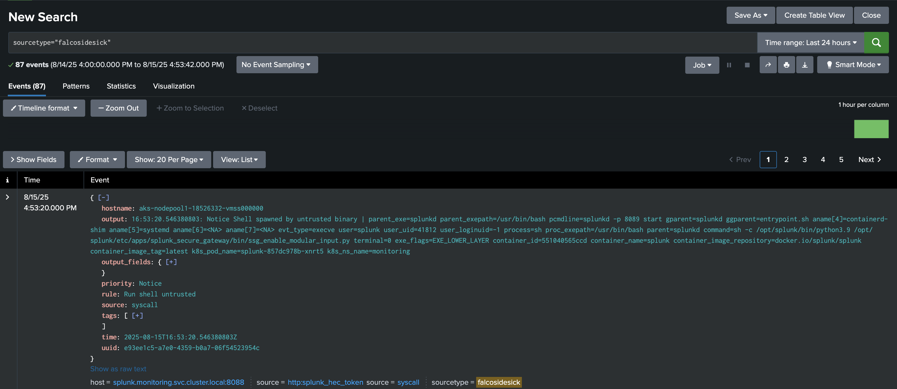

# Splunk

- **Category**: Logs
- **Website**: 
  - https://www.splunk.com/
  - https://docs.splunk.com/Documentation/Splunk/7.0.3/Data/UsetheHTTPEventCollector#About_Event_Collector_tokens

## Table of content

- [Splunk](#splunk)
  - [Table of content](#table-of-content)
  - [Configuration](#configuration)
  - [Example of config.yaml](#example-of-configyaml)
  - [Additional info](#additional-info)
  - [Screenshots](#screenshots)

## Configuration

| Setting                  | Env var                  | Default value    | Description                                                                                                                         |
| -------------------------| -----------------------  | ---------------- | ----------------------------------------------------------------------------------------------------------------------------------- |
| `splunk.host`            | `SPLUNK_HOST`            |                  | Hostname of the target Splunk service (ex: http://host:port/services/collector/event), if not empty, Splunk output is **enabled**   |
| `splunk.token`           | `SPLUNK_TOKEN`           |                  | Specify the authentication token for the HTTP Event Collector interface                                                             |
| `splunk.customheaders`   | `SPLUNK_CUSTOMHEADERS`   |                  | A list of comma separated custom headers to add to the request                                                                      |
| `splunk.checkcert`       | `SPLUNK_CHECKCERT`       | `true`           | Check if ssl certificate of the output is valid                                                                                      |
| `splunk.minimumpriority` | `SPLUNK_MINIMUMPRIORITY` | `""` (= `debug`) | Minimum priority of event for using this output, order is `emergency,alert,critical,error,warning,notice,informational,debug or ""` |

> [!NOTE]
The Env var values override the settings from yaml file.

## Example of config.yaml

```yaml
splunk:
  # -- Hostname of the target Splunk service (ex: http://host:port/services/collector/event)
  host: "http://splunk:8088/services/collector/event"
  # -- Specify the authentication token for the HTTP Event Collector interface.
  token: "abcd1234"
  # -- check if ssl certificate of the output is valid
  checkcert: false
  # -- a list of comma separated custom headers to add, syntax is "key:value,key:value"
  customheaders: ""
  # -- minimum priority of event to use this output, order is `emergency\|alert\|critical\|error\|warning\|notice\|informational\|debug or ""`
  minimumpriority: ""
```

## Additional info

## Screenshots


