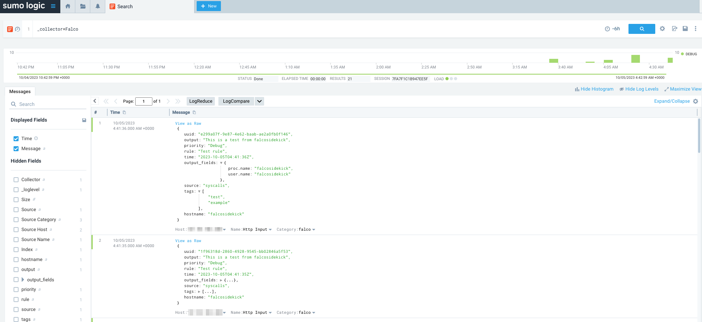

# SumoLogic


- **Category**: Logs
- **Website**: https://www.sumologic.com/

## Table of content

- [SumoLogic](#sumologic)
  - [Table of content](#table-of-content)
  - [Configuration](#configuration)
  - [Example of config.yaml](#example-of-configyaml)
  - [Screenshots](#screenshots)

## Configuration

| Setting                | Env var                | Default value     | Description                                                                                                                         |
| ---------------------- | ---------------------- | ----------------- | ----------------------------------------------------------------------------------------------------------------------------------- |
| `sumologic.receiverurl`        | `SUMOLOGIC_RECEIVERURL`        |                   | https://[SumoEndpoint]/receiver/v1/http/[UniqueHTTPCollectorCode], if not empty, SumoLogic output is **enabled**                                                              |
| `sumologic.sourcecategory`            | `SUMOLOGIC_SOURCECATEGORY`            |                   | Override the default Source Category for the collector                                                                                                               |
| `sumologic.sourcehost`          | `SUMOLOGIC_SOURCEHOST`          |                   | Override the default Source Host for the collector                                                                                                            |
| `sumologic.name`          | `SUMOLOGIC_NAME`          |                   | Override the default Name for the collector                                                                                                     |
| `sumologic.checkcert`       | `SUMOLOGIC_CHECKCERT`       |   | Check if ssl certificate of the output is valid                                                                                     |
| `sumologic.minimumpriority` | `SUMOLOGIC_MINIMUMPRIORITY` | `""` (= `debug`)  | Minimum priority of event for using this output, order is `emergency,alert,critical,error,warning,notice,informational,debug or ""` |


> [!NOTE]
The Env var values override the settings from yaml file.

## Example of config.yaml

```yaml
sumologic:
  receiverURL: "" # Sumologic HTTP Source URL, if not empty, Sumologic output is enabled
  # sourceCategory: "" # Override the default Sumologic Source Category
  # sourceHost: "" # Override the default Sumologic Source Host
  # Name: "" # Override the default Sumologic Source Name
  # minimumpriority: "" # minimum priority of event for using this output, order is emergency|alert|critical|error|warning|notice|informational|debug or "" (default)
  # checkcert: true # check if ssl certificate of the output is valid (default: true)
```

## Screenshots

With SumoLogic

