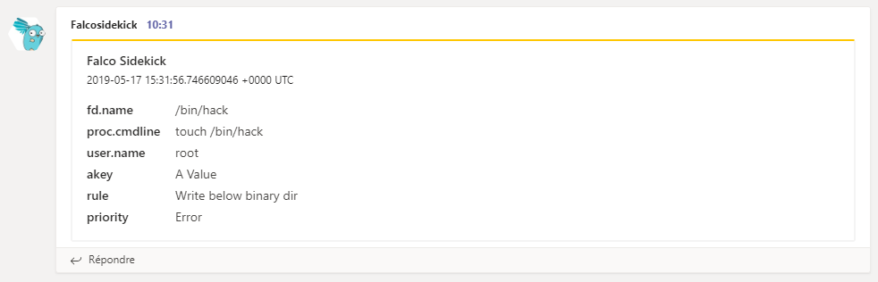
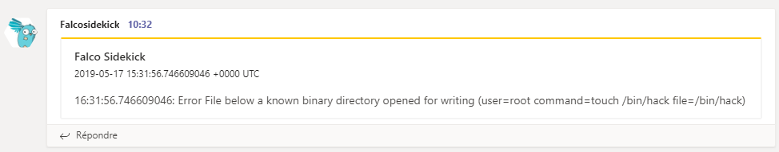

# Teams


- **Category**: Chat/Messaging
- **Website**: https://teams.com

## Table of content

- [Teams](#teams)
  - [Table of content](#table-of-content)
  - [Configuration](#configuration)
  - [Example of config.yaml](#example-of-configyaml)
  - [Screenshots](#screenshots)

## Configuration

| Setting                 | Env var                 | Default value                                                                                       | Description                                                                                                                         |
| ----------------------- | ----------------------- | --------------------------------------------------------------------------------------------------- | ----------------------------------------------------------------------------------------------------------------------------------- |
| `teams.webhookurl`      | `TEAMS_WEBHOOKURL`      |                                                                                                     | Teams WebhookURL, if not empty, Teams output is **enabled**                                                                         |
| `teams.activityimage`   | `TEAMS_ACTIVITYIMAGE`   | `https://raw.githubusercontent.com/falcosecurity/falcosidekick/master/imgs/falcosidekick_color.png` | Image for message section                                                                                                           |
| `teams.outputformat`    | `TEAMS_OUTPUTFORMAT`    | `all`                                                                                               | `all`, `text`, `facts`                                                                                                    |
| `teams.minimumpriority` | `TEAMS_MINIMUMPRIORITY` | `""` (= `debug`)                                                                                    | Minimum priority of event for using this output, order is `emergency,alert,critical,error,warning,notice,informational,debug or ""` |


> [!NOTE]
The Env var values override the settings from yaml file.

## Example of config.yaml

```yaml
teams:
  webhookurl: "" # Teams WebhookURL, if not empty, Teams output is enabled
  # activityimage: "" # Image for message section
  # outputformat: "text" # all (default), text, facts
  # minimumpriority: "debug" # minimum priority of event for using this output, order is emergency|alert|critical|error|warning|notice|informational|debug or "" (default)
```
## Screenshots

(TEAMS_OUTPUTFORMAT="**all**")



(TEAMS_OUTPUTFORMAT="**text**")



