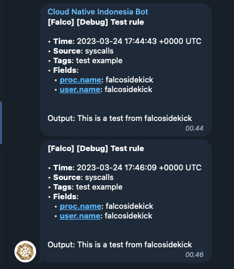

# Telegram

- **Category**: Chat
- **Website**: https://telegram.org/

## Table of content

- [Telegram](#telegram)
  - [Table of content](#table-of-content)
  - [Configuration](#configuration)
  - [Example of config.yaml](#example-of-configyaml)
  - [Additional info](#additional-info)
  - [Screenshots](#screenshots)

## Configuration

| Setting                    | Env var                    | Default value    | Description                                                                                                                         |
| -------------------------- | -------------------------- | ---------------- | ----------------------------------------------------------------------------------------------------------------------------------- |
| `telegram.chatid`          | `TELEGRAM_CHATID`          |                  | Telegram Identifier of the shared chat, if not empty, Telegram is **enabled**                                                       |
| `telegram.token`           | `TELEGRAM_TOKEN`           |                  | Telegram bot authentication token                                                                                                   |
| `telegram.minimumpriority` | `TELEGRAM_MINIMUMPRIORITY` | `""` (= `debug`) | Minimum priority of event for using this output, order is `emergency,alert,critical,error,warning,notice,informational,debug or ""` |

> [!NOTE]
The Env var values override the settings from yaml file.

## Example of config.yaml

```yaml
telegram:
  chatid: "" # Telegram Identifier of the shared chat, if not empty, Telegram is enabled
  token: "" # Telegram bot authentication token
  # minimumpriority: "" # minimum priority of event for using this output, order is emergency|alert|critical|error|warning|notice|informational|debug or "" (default)
```

## Additional info

## Screenshots

