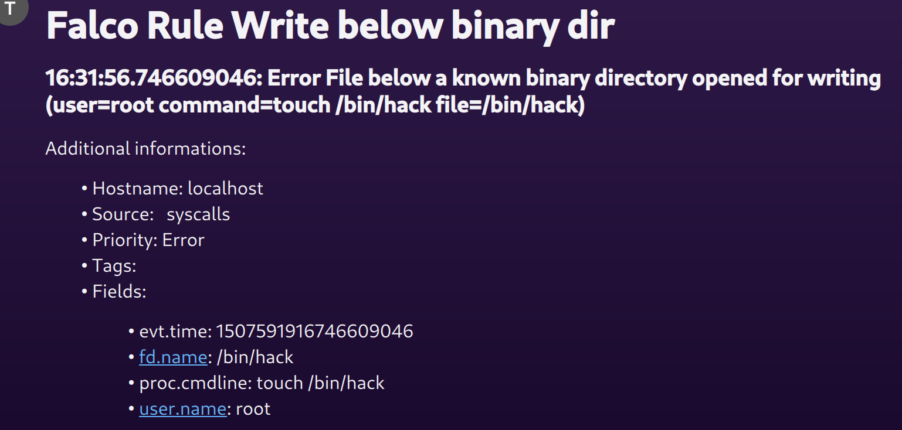

# Webex

- **Category**: Chat/Messaging
- **Website**: https://webex.com

## Table of content

- [Teams](#teams)
  - [Table of content](#table-of-content)
  - [Configuration](#configuration)
  - [Example of config.yaml](#example-of-configyaml)
  - [Screenshots](#screenshots)

## Configuration

| Setting                 | Env var                 | Default value                                                                                       | Description                                                                                                                         |
| ----------------------- | ----------------------- | --------------------------------------------------------------------------------------------------- | ----------------------------------------------------------------------------------------------------------------------------------- |
| `webex.webhookurl`      | `WEBEX_WEBHOOKURL`      |                                                                                                     | Teams WebhookURL, if not empty, Webex output is **enabled** |
| `webex.minimumpriority` | `WEBEX_MINIMUMPRIORITY` | `""` (= `debug`)                                                                                    | Minimum priority of event for using this output, order is `emergency,alert,critical,error,warning,notice,informational,debug or ""` |


> [!NOTE]
The Env var values override the settings from yaml file.

## Example of config.yaml

```yaml
webex:
  webhookurl: "" # Webex WebhookURL, if not empty, Webex output is enabled
  # minimumpriority: "debug" # minimum priority of event for using this output, order is emergency|alert|critical|error|warning|notice|informational|debug or "" (default)
```
## Screenshots



