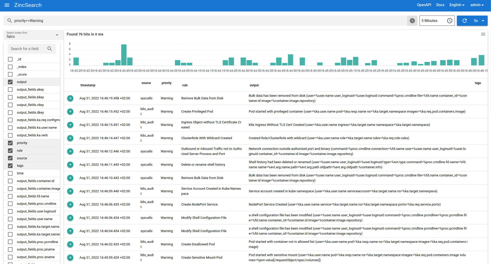

# Zincsearch

- **Category**: Logs
- **Website**: https://docs.zincsearch.com/

## Table of content

- [Zincsearch](#zincsearch)
  - [Table of content](#table-of-content)
  - [Configuration](#configuration)
  - [Example of config.yaml](#example-of-configyaml)
  - [Additional info](#additional-info)
  - [Screenshots](#screenshots)

## Configuration

| Setting                      | Env var                      | Default value    | Description                                                                                                                         |
| ---------------------------- | ---------------------------- | ---------------- | ----------------------------------------------------------------------------------------------------------------------------------- |
| `zincsearch.hostport`        | `ZINCSEARCH_HOSTPORT`        |                  | http://{domain or ip}:{port}, if not empty, ZincSearch output is **enabled**                                                        |
| `zincsearch.index`           | `ZINCSEARCH_INDEX`           | `falco`          | Index                                                                                                                               |
| `zincsearch.username`        | `ZINCSEARCH_USERNAME`        |                  | Use this username to authenticate to ZincSearch                                                                                     |
| `zincsearch.password`        | `ZINCSEARCH_PASSWORD`        |                  | Use this password to authenticate to ZincSearch                                                                                     |
| `zincsearch.checkcert`       | `ZINCSEARCH_CHECKCERT`       | `true`           | Check if ssl certificate of the output is valid                                                                                     |
| `zincsearch.minimumpriority` | `ZINCSEARCH_MINIMUMPRIORITY` | `""` (= `debug`) | Minimum priority of event for using this output, order is `emergency,alert,critical,error,warning,notice,informational,debug or ""` |

> [!NOTE]
The Env var values override the settings from yaml file.

## Example of config.yaml

```yaml
zincsearch:
  hostport: "" # http://{domain or ip}:{port}, if not empty, ZincSearch output is enabled
  # index: "falco" # Index (default: falco)
  # username: "" # Use this username to authenticate to ZincSearch (default: "")
  # password: "" # Use this password to authenticate to ZincSearch (default: "")
  # checkcert: true # check if ssl certificate of the output is valid (default: true)
  # minimumpriority: "" # minimum priority of event for using this output, order is emergency|alert|critical|error|warning|notice|informational|debug or "" (default)
```

## Additional info

## Screenshots

